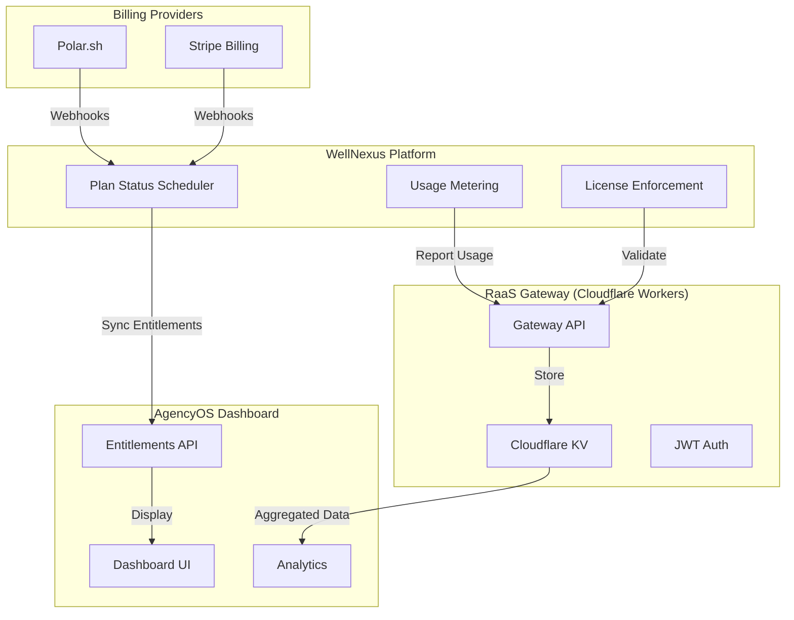
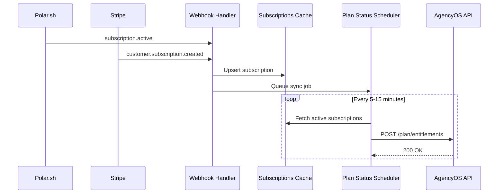

# RaaS Gateway Integration Guide

> **Version:** 1.0.0
> **Last Updated:** 2026-03-09
> **Status:** Production Ready

Comprehensive documentation for RaaS Gateway integration, covering license enforcement, usage metering, plan status sync, and AgencyOS dashboard integration.

---

## Table of Contents

1. [Architecture Overview](#architecture-overview)
2. [License Enforcement Flow](#license-enforcement-flow)
3. [Usage Metering](#usage-metering)
4. [Webhook Handling](#webhook-handling)
5. [Plan Status Sync](#plan-status-sync)
6. [AgencyOS Dashboard Integration](#agencyos-dashboard-integration)
7. [API Reference](#api-reference)
8. [Deployment Guide](#deployment-guide)

---

## Architecture Overview



### Components

| Component | Location | Purpose |
|-----------|----------|---------|
| Usage Metering | `src/lib/usage-metering.ts` | Track API calls, AI calls, tokens, compute minutes |
| License Enforcement | `src/lib/license-compliance-client.ts` | Validate RaaS license keys |
| RaaS Gateway Client | `src/lib/raas-gateway-client.ts` | Client for Gateway API communication |
| Plan Status Scheduler | `src/services/plan-status-scheduler.ts` | Background sync of subscription statuses |
| AgencyOS Client | `src/lib/agencyos-api-client.ts` | Internal API client for dashboard sync |
| Gateway Auth Client | `src/lib/gateway-auth-client.ts` | JWT token generation with mk_ API keys |

---

## License Enforcement Flow

### End-to-End Flow

```
User Request → License Middleware → RaaS Gateway Client → Gateway API
                                        ↓
                                   Cache Check
                                        ↓
                              JWT Auth (mk_ API key)
                                        ↓
                              Gateway Response
                                        ↓
                              Update Local Cache
                                        ↓
                              Allow/Deny Request
```

### License Key Format

```
raas_<tier>_<random_string>

Examples:
- raas_basic_xK9mN2pL4qR7sT1v
- raas_premium_aB3cD5eF7gH9iJ2k
- raas_enterprise_zY8xW6vU4tS2rQ0p
```

### Tier Entitlements

| Tier | API Calls | AI Calls | Tokens | Compute Min | Features |
|------|-----------|----------|--------|-------------|----------|
| Basic | 1,000 | 100 | 100K | 60 | API access, model inference |
| Premium | 10,000 | 1,000 | 1M | 600 | + Agent execution, priority support |
| Enterprise | 100,000 | 10,000 | 10M | 6,000 | + Custom models, dedicated infra, SLA |

### Validation Code Example

```typescript
import { raasGatewayClient } from '@/lib/raas-gateway-client'

// Validate license key
const result = await raasGatewayClient.validateLicenseKey('raas_premium_xxx', {
  orgId: 'org-123',
  userId: 'user-456',
})

if (result.isValid) {
  console.log(`Tier: ${result.tier}`)
  console.log(`Features: ${JSON.stringify(result.features)}`)
  console.log(`Expires: ${result.expiresAt}`)
} else {
  console.log(`Status: ${result.status}`)
  console.log(`Reason: ${result.suspensionReason}`)
}
```

---

## Usage Metering

### Tracked Metrics

| Metric | Description | Unit |
|--------|-------------|------|
| `api_calls` | REST API requests | count |
| `ai_calls` | AI inference requests | count |
| `tokens` | LLM tokens processed | count |
| `compute_minutes` | Agent execution time | minutes |
| `storage_gb` | Data storage used | GB |
| `emails` | Emails sent | count |

### Tracking Implementation

```typescript
import { usageMeter } from '@/lib/usage-metering'

// Track usage
await usageMeter.track({
  orgId: 'org-123',
  feature: 'api_calls',
  quantity: 1,
  metadata: {
    endpoint: '/api/v1/chat',
    model: 'gpt-4',
  },
})

// Get current usage for period
const usage = await usageMeter.getCurrentUsage('org-123')
console.log(`API calls: ${usage.api_calls}`)
```

### Usage Record Schema

```typescript
interface UsageRecord {
  id: string
  org_id: string
  user_id: string
  feature: string // metric type
  quantity: number
  period_start: string // ISO 8601
  period_end: string // ISO 8601
  metadata?: Record<string, unknown>
  created_at: string
}
```

---

## Webhook Handling

### Polar Webhook Events

| Event | Description | Action |
|-------|-------------|--------|
| `subscription.created` | New subscription started | Create subscription cache entry |
| `subscription.updated` | Subscription modified | Update cache, sync entitlements |
| `subscription.active` | Subscription activated | Enable entitlements |
| `subscription.canceled` | Subscription canceled | Schedule revocation |
| `subscription.expired` | Subscription expired | Revoke entitlements |

### Stripe Webhook Events

| Event | Description | Action |
|-------|-------------|--------|
| `customer.subscription.created` | New subscription | Create subscription cache |
| `customer.subscription.updated` | Subscription updated | Update cache |
| `customer.subscription.deleted` | Subscription deleted | Revoke entitlements |
| `invoice.payment_failed` | Payment failed | Trigger dunning workflow |

### Webhook Handler Implementation

```typescript
// supabase/functions/polar-webhook/index.ts
import { PlanStatusScheduler } from '@/services/plan-status-scheduler'

const scheduler = new PlanStatusScheduler()

// Handle Polar webhook
async function handlePolarWebhook(payload: PolarWebhookData) {
  await scheduler.processPolarWebhook(payload)
}
```

### Webhook Signature Verification

```typescript
// Verify Polar webhook signature
import { createHmac } from 'crypto'

function verifyPolarSignature(
  signature: string,
  body: string,
  secret: string
): boolean {
  const expectedSignature = createHmac('sha256', secret)
    .update(body)
    .digest('hex')

  return signature === `polar=${expectedSignature}`
}
```

---

## Plan Status Sync

### Sync Architecture



### Sync Scheduler Service

```typescript
import { PlanStatusScheduler } from '@/services/plan-status-scheduler'

const scheduler = new PlanStatusScheduler()

// Run scheduled sync (Cloudflare Worker cron)
const result = await scheduler.runSync()
console.log(`Synced: ${result.syncedCount}`)
console.log(`Failed: ${result.failedCount}`)

// Process individual webhook
await scheduler.processPolarWebhook(webhookPayload)
await scheduler.processStripeWebhook(webhookPayload)
```

### Sync Flow Diagram

```
┌─────────────────┐     ┌─────────────────┐     ┌─────────────────┐
│  Polar/Stripe   │────▶│  Webhook Handler│────▶│  Subscriptions  │
│   Webhooks      │     │  (Edge Function)│     │     Cache       │
└─────────────────┘     └─────────────────┘     └─────────────────┘
                                                       │
                                                       ▼
┌─────────────────┐     ┌─────────────────┐     ┌─────────────────┐
│  AgencyOS       │◀────│  Plan Status    │◀────│   Sync Queue    │
│   Dashboard     │     │   Scheduler     │     │                 │
└─────────────────┘     └─────────────────┘     └─────────────────┘
```

### Database Tables

| Table | Purpose |
|-------|---------|
| `plan_sync_queue` | Queue for pending sync jobs |
| `plan_sync_log` | Audit trail of sync operations |
| `subscriptions_cache` | Cached subscription data from webhooks |
| `entitlements_cache` | Cached entitlements synced to AgencyOS |

---

## AgencyOS Dashboard Integration

### Internal API Endpoints

| Endpoint | Method | Purpose |
|----------|--------|---------|
| `/api/internal/plan/entitlements` | POST | Update plan entitlements |
| `/api/internal/plan/entitlements/:orgId` | GET | Get current entitlements |
| `/api/internal/plan/entitlements/:orgId/revoke` | POST | Revoke entitlements |
| `/api/internal/usage/sync` | POST | Sync usage data |
| `/api/internal/org/:orgId/status` | GET | Get organization status |

### JWT Authentication

```typescript
import { GatewayAuthClient } from '@/lib/gateway-auth-client'

const authClient = new GatewayAuthClient({
  issuer: 'wellnexus.vn',
  audience: 'agencyos.network',
  apiKey: 'mk_xxxxxxxxxxxxxxxx', // mk_ prefixed key
})

// Get valid token (cached or new)
const { token, expiresAt } = authClient.getValidToken('org-123')

// Use in API calls
const response = await fetch('https://agencyos.network/api/internal/plan/entitlements', {
  method: 'POST',
  headers: {
    'Authorization': `Bearer ${token}`,
    'Content-Type': 'application/json',
  },
  body: JSON.stringify(payload),
})
```

### JWT Payload Structure

```json
{
  "iss": "wellnexus.vn",
  "aud": "agencyos.network",
  "sub": "org-123",
  "license_id": "lic-456",
  "mk_key": "mk_xxxxxxxxxxxxxxxx",
  "exp": 1710000000,
  "iat": 1709996400,
  "jti": "unique-token-id"
}
```

---

## API Reference

### RaaS Gateway API

#### POST /v1/validate-license

Validate a license key.

**Request:**
```json
{
  "licenseKey": "raas_premium_xxx"
}
```

**Response:**
```json
{
  "isValid": true,
  "tier": "premium",
  "features": {
    "api_access": true,
    "model_inference": true,
    "agent_execution": true
  },
  "expiresAt": "2026-12-31T23:59:59Z",
  "daysRemaining": 297,
  "status": "active"
}
```

#### POST /api/v1/usage/report

Report usage to Gateway.

**Headers:**
- `Authorization: Bearer <JWT>`
- `X-Idempotency-Key: sync_org123_report_2026-03`

**Request:**
```json
{
  "orgId": "org-123",
  "licenseId": "lic-456",
  "period": "2026-03",
  "metrics": {
    "api_calls": {
      "totalUsage": 5000,
      "includedQuota": 10000,
      "overageUnits": 0,
      "ratePerUnit": 0.001,
      "totalCost": 0
    }
  },
  "timestamp": "2026-03-09T12:00:00Z"
}
```

#### GET /api/v1/usage/:orgId

Fetch aggregated usage from Gateway KV.

**Response:**
```json
{
  "success": true,
  "org_id": "org-123",
  "period": "2026-03",
  "metrics": [
    {
      "metric_type": "api_calls",
      "metric_value": 5000,
      "period_start": "2026-03-01T00:00:00Z",
      "period_end": "2026-03-31T23:59:59Z"
    }
  ]
}
```

### Plan Status Sync API

#### POST /functions/v1/sync-plan-status

Edge Function for plan status sync.

**Request Body:**
```json
{
  "action": "sync",
  "orgId": "org-123",
  "planStatus": "active",
  "entitlements": {
    "plan_id": "raas_premium",
    "plan_name": "RaaS Premium",
    "features": {
      "api_access": true,
      "agent_execution": true
    },
    "quota_limits": {
      "api_calls": 10000,
      "ai_calls": 1000
    },
    "overage_rates": {
      "api_calls": 0.0008,
      "ai_calls": 0.008
    },
    "effective_date": "2026-03-01T00:00:00Z",
    "expiry_date": "2026-04-01T00:00:00Z"
  }
}
```

**Response:**
```json
{
  "success": true,
  "syncedCount": 1,
  "failedCount": 0,
  "timestamp": "2026-03-09T12:00:00Z"
}
```

---

## Deployment Guide

### Prerequisites

- Supabase project with Edge Functions enabled
- Cloudflare Workers account (for RaaS Gateway)
- Polar.sh or Stripe account for billing
- AgencyOS deployment for dashboard

### Environment Variables

```bash
# RaaS Gateway
VITE_RAAS_GATEWAY_URL=https://raas.agencyos.network
VITE_RAAS_GATEWAY_API_KEY=mk_xxxxxxxxxxxxxxxx

# AgencyOS
VITE_AGENCYOS_API_URL=https://agencyos.network/api/internal
AGENCYOS_API_KEY=mk_xxxxxxxxxxxxxxxx

# Billing Webhooks
POLAR_WEBHOOK_SECRET=whsec_xxxxxxxxxxxxxxxx
STRIPE_WEBHOOK_SECRET=whsec_xxxxxxxxxxxxxxxx

# JWT Auth
JWT_SECRET=your-super-secret-jwt-key-min-32-chars
```

### Supabase Edge Functions

Deploy the Edge Functions:

```bash
# Link Supabase project
npx supabase link --project-ref your-project-ref

# Deploy Edge Functions
npx supabase functions deploy sync-plan-status
npx supabase functions deploy polar-webhook
npx supabase functions deploy stripe-webhook
```

### Database Migrations

Run the migration:

```bash
npx supabase db push
```

This creates:
- `plan_sync_queue` - Sync job queue
- `plan_sync_log` - Audit trail
- `subscriptions_cache` - Webhook data cache
- `entitlements_cache` - Entitlements cache
- RPC functions for sync operations

### Cloudflare Worker (RaaS Gateway)

Deploy the Gateway Worker:

```bash
# Install Wrangler CLI
npm install -g wrangler

# Login to Cloudflare
wrangler login

# Deploy Gateway Worker
cd apps/raas-gateway
wrangler deploy
```

### Cron Job Configuration

Set up Cloudflare Worker cron for scheduled sync:

```toml
# wrangler.toml
[triggers]
crons = ["*/10 * * * *"]  # Every 10 minutes
```

### Testing

```bash
# Test local usage metering
npm test -- src/__tests__/usage-metering.test.ts

# Test plan status sync
npm test -- src/__tests__/plan-status-scheduler.test.ts

# Test Gateway client
npm test -- src/__tests__/raas-gateway-client.test.ts
```

---

## Troubleshooting

### Common Issues

| Issue | Cause | Solution |
|-------|-------|----------|
| JWT token expired | Token cache not refreshing | Check `refreshBufferMs` setting |
| Webhook not received | Incorrect webhook URL | Verify endpoint in Polar/Stripe dashboard |
| Sync failing | API key invalid | Ensure `mk_` prefix in API key |
| Rate limited | Too many requests | Increase sync interval, add caching |

### Debug Queries

```sql
-- Check pending sync jobs
SELECT * FROM plan_sync_queue WHERE status = 'pending';

-- Check recent sync failures
SELECT * FROM plan_sync_log WHERE sync_status = 'failed' ORDER BY created_at DESC LIMIT 10;

-- Check cached subscriptions
SELECT org_id, status, plan_id FROM subscriptions_cache WHERE status IN ('active', 'trialing');
```

---

_Last Updated: 2026-03-09_
_Author: AgencyOS RaaS Team_
