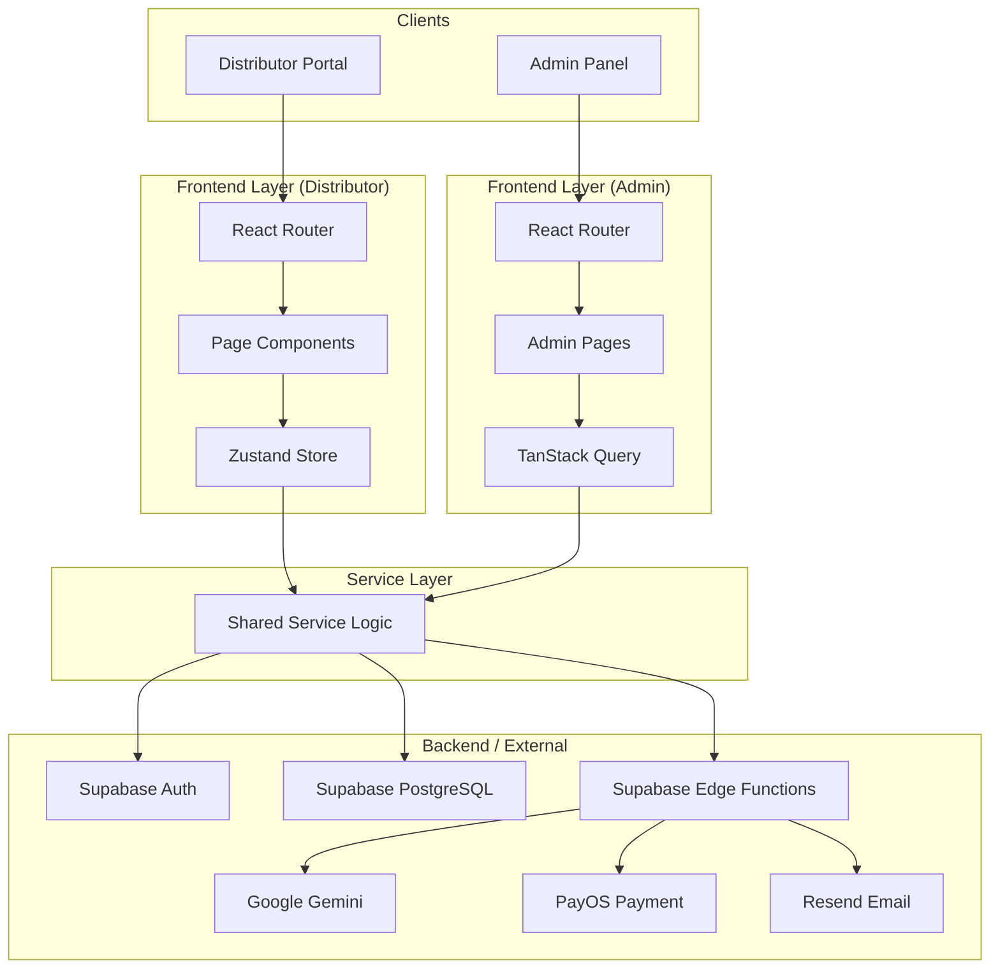

# System Architecture

## Overview
WellNexus consists of two complementary client-side Single Page Applications (SPAs): the **Distributor Portal** (Root) and the **Admin Panel** (Subdirectory). Both interact with shared serverless backend services (Supabase) and AI APIs (Gemini).

## Architecture Diagram

## Core Components

### 1. Distributor Portal (Frontend)
- **Framework:** React 19.2.4, Vite 7.3.1, TypeScript 5.9.3
- **State:** Zustand (Global State)
- **Focus:** Sales, Team Management, AI Coaching
- **Key Modules:** Dashboard, Marketplace, Agent-OS, Network Visualization, Wallet

### 2. Admin Panel (Frontend)
- **Framework:** React 19.2.4, Vite 7.3.1, TypeScript 5.9.3
- **State:** TanStack Query (Server State) + Zustand (Auth)
- **Styling:** Tailwind CSS + Radix UI
- **Focus:** Platform Oversight, Data Management, Analytics
- **Key Modules:**
    - **Distributor Manager:** View/Edit distributor details and hierarchies.
    - **Order Manager:** Transaction processing and status workflows.
    - **Withdrawal Manager:** Payout request processing and approval flows.
    - **Customer CRM:** User data and behavior tracking.

### 3. Shared Services
- **Supabase:** Authentication, PostgreSQL Database, Edge Functions, Realtime subscriptions.
- **Gemini AI:** Intelligence layer for coaching and agents (via Edge Function).

### 4. Data Flow
- **Distributor Portal:** Optimized for real-time interaction and client-side state persistence.
  1. **Action:** User interacts with UI (e.g., "Buy Now").
  2. **State Update:** Component triggers Zustand action.
  3. **Service Call:** Action calls Service layer.
  4. **Mutation:** Store updates state.
  5. **Re-render:** Subscribed components update via selectors.
- **Admin Panel:** Optimized for data consistency and fresh server-side data fetching using React Query.

### 5. Security
- **Environment Variables:** API keys stored in `.env`.
- **Authentication:**
  - Supabase Auth integration for Sign Up, Login, and Password Recovery.
  - Secure in-memory token storage (no localStorage for sensitive tokens).
- **Headers:** Content Security Policy (CSP) and HSTS enforced via Vercel configuration.
- **Compliance:** Automated tax calculation logic enforced on client-side (for MVP) before transaction recording.

### 6. Observability & Monitoring
- **Error Tracking:** Sentry (100% sample rate for production errors).
- **Performance:** Core Web Vitals monitoring via Vercel Analytics.

## Deployment Pipeline
- **Host:** Vercel (Edge Network)
- **Trigger:** Push to `main` branch.
- **Process:** Build -> Test -> Deploy -> CDN Propagation.
- **Optimization:** Aggressive caching policies for static assets; immutable deployments.
