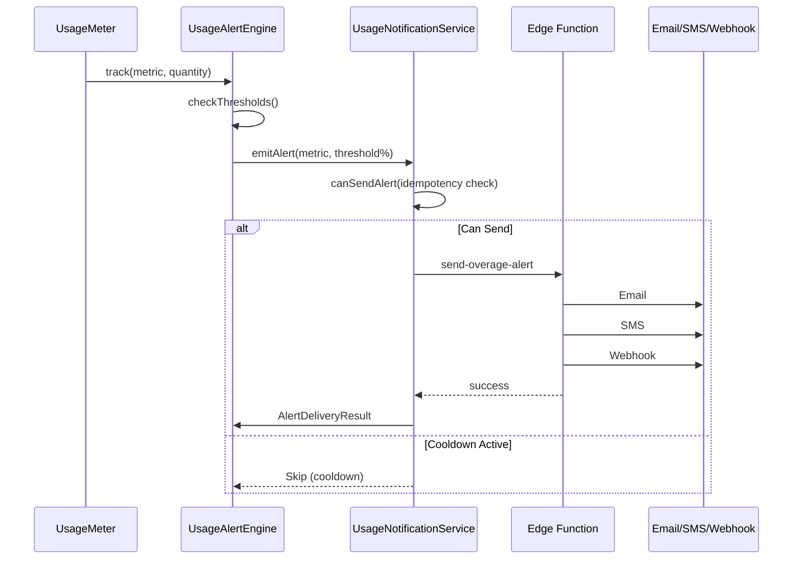

# Phase 1: Overage Notification System

## Overview

| Attribute | Value |
|-----------|-------|
| **Priority** | P1 - Critical for user experience |
| **Effort** | 5 hours |
| **Status** | Pending |
| **Dependencies** | Usage Alert Engine (existing), Usage Metering (existing) |

---

## Requirements

### Functional Requirements

1. **Threshold Monitoring**
   - Monitor usage at 80%, 90%, 100% of quota
   - Support multiple metrics: api_calls, tokens, compute_minutes, model_inferences, agent_executions
   - Real-time detection when threshold crossed

2. **Multi-Channel Notifications**
   - Email via Resend API
   - SMS via Twilio
   - Webhook to AgencyOS dashboard

3. **Idempotency**
   - No duplicate alerts within cooldown period (default 1 hour)
   - Per-user, per-metric, per-threshold tracking

4. **Localization**
   - Vietnamese language support
   - English language support
   - Template-based messaging

### Non-Functional Requirements

- Latency: < 5 seconds from threshold breach to notification sent
- Throughput: Support 1000 concurrent notifications
- Reliability: >98% delivery success rate
- Scalability: Handle 10x traffic spikes

---

## Architecture



---

## Files to Create

### 1. `src/services/usage-notification-service.ts`

```typescript
/**
 * Usage Notification Service
 * Orchestrates multi-channel notifications for usage thresholds
 */

export interface NotificationConfig {
  userId: string
  orgId?: string
  licenseId?: string
  metricType: AlertMetricType
  thresholdPercentage: AlertThreshold
  currentUsage: number
  quotaLimit: number
}

export interface NotificationResult {
  success: boolean
  emailSent: boolean
  smsSent: boolean
  webhookSent: boolean
  errors?: string[]
}

export class UsageNotificationService {
  private supabase: SupabaseClient
  private cooldownMs: number

  constructor(supabase: SupabaseClient, cooldownMs: number = 3600000) {
    this.supabase = supabase
    this.cooldownMs = cooldownMs
  }

  async sendNotification(config: NotificationConfig): Promise<NotificationResult>
  async checkCooldown(userId: string, metric: string, threshold: number): Promise<boolean>
  async getNotificationChannels(userId: string): Promise<NotificationChannels>
}
```

### 2. `supabase/functions/send-overage-alert/index.ts`

```typescript
/**
 * Edge Function: Send Overage Alert
 * Handles email, SMS, and webhook notifications
 */

interface AlertPayload {
  user_id: string
  metric_type: string
  threshold_percentage: number
  current_usage: number
  quota_limit: number
  locale: 'vi' | 'en'
}

// POST /functions/v1/send-overage-alert
// Body: AlertPayload
```

### 3. `src/components/billing/RealtimeQuotaTracker.tsx`

```tsx
/**
 * Real-time Quota Tracker Component
 * Displays live usage vs quota with threshold indicators
 */

interface RealtimeQuotaTrackerProps {
  userId: string
  metrics?: AlertMetricType[]
  thresholds?: AlertThreshold[]
}

export const RealtimeQuotaTracker: React.FC<RealtimeQuotaTrackerProps>
```

### 4. `src/__tests__/usage-notification-service.test.ts`

```typescript
describe('UsageNotificationService', () => {
  describe('sendNotification', () => {
    it('should send email when threshold crossed')
    it('should respect cooldown period')
    it('should handle all notification channels')
  })
})
```

---

## Files to Modify

### 1. `src/lib/usage-alert-engine.ts`

Add SMS support and enhance threshold logic:

```typescript
// Add to UsageAlertConfig
interface UsageAlertConfig {
  // ... existing
  smsEnabled?: boolean
  webhookUrl?: string
}

// Enhance emitAlert to support SMS
async emitAlert(options: AlertOptions & { smsTemplate?: string }): Promise<AlertDeliveryResult>
```

### 2. `src/hooks/use-usage-alerts.ts`

Add real-time subscription:

```typescript
// Add Supabase Realtime subscription
useEffect(() => {
  const channel = supabase
    .channel('usage_alerts')
    .on('postgres_changes', {
      event: 'INSERT',
      schema: 'public',
      table: 'usage_alert_events',
      filter: `user_id=eq.${userId}`,
    }, (payload) => {
      // Trigger UI notification
      toast.notify(payload.new)
    })
    .subscribe()

  return () => channel.unsubscribe()
}, [userId])
```

### 3. Translation Files

Add to `src/locales/vi/billing.ts` and `src/locales/en/billing.ts`:

```typescript
export default {
  // ... existing
  overage: {
    notification: {
      '80_warning': 'Cảnh báo: Đã sử dụng {{percentage}}% quota {{metric}}',
      '90_critical': 'Sắp hết: {{percentage}}% quota {{metric}} đã được sử dụng',
      '100_exhausted': 'Đã hết: {{metric}} vượt quá giới hạn!',
      email_subject: {
        '80': '[WellNexus] Canh bao su dung {{percentage}}% quota',
        '90': '[WellNexus] Sap het {{metric}}',
        '100': '[WellNexus] Da het {{metric}}!',
      },
      sms: {
        '80': 'WellNexus: Ban da dung {{percentage}}% {{metric}}. Truy cap https://wellnexus.vn/dashboard',
        '90': 'WellNexus: Sap het {{metric}}!{{percentage}}% da dung. Nap them ngay!',
        '100': 'WellNexus: DA HET {{metric}}! Thanh toan phi vuot muc de tiep tuc.',
      },
    },
  },
}
```

---

## Implementation Steps

### Step 1: Create Notification Service (1.5h)

- [ ] Create `src/services/usage-notification-service.ts`
- [ ] Implement `sendNotification()` with email/SMS/webhook
- [ ] Implement `checkCooldown()` with database lookup
- [ ] Implement `getNotificationChannels()` from user preferences
- [ ] Add error handling and logging

### Step 2: Create Edge Function (1h)

- [ ] Create `supabase/functions/send-overage-alert/index.ts`
- [ ] Implement email sending via Resend API
- [ ] Implement SMS sending via Twilio
- [ ] Implement webhook sending to AgencyOS
- [ ] Add JWT validation for security

### Step 3: Create Real-time UI Component (1.5h)

- [ ] Create `src/components/billing/RealtimeQuotaTracker.tsx`
- [ ] Implement Supabase Realtime subscription
- [ ] Add visual threshold indicators (80%/90%/100%)
- [ ] Add animations with Framer Motion
- [ ] Add responsive design

### Step 4: Update Existing Services (0.5h)

- [ ] Update `src/lib/usage-alert-engine.ts` with SMS support
- [ ] Update `src/hooks/use-usage-alerts.ts` with real-time
- [ ] Add translation keys to `vi.ts` and `en.ts`

### Step 5: Write Tests (0.5h)

- [ ] Create `src/__tests__/usage-notification-service.test.ts`
- [ ] Test threshold detection logic
- [ ] Test cooldown/idempotency
- [ ] Test multi-channel delivery

---

## Success Criteria

- [ ] Notifications sent at exactly 80%, 90%, 100% thresholds
- [ ] Email notifications delivered via Resend API
- [ ] SMS notifications delivered via Twilio
- [ ] Webhook notifications sent to AgencyOS
- [ ] No duplicate alerts within 1-hour cooldown
- [ ] i18n complete for Vietnamese and English
- [ ] Real-time UI updates via Supabase Realtime
- [ ] Unit tests pass with >90% coverage

---

## Risk Assessment

| Risk | Probability | Impact | Mitigation |
|------|-------------|--------|------------|
| Twilio SMS delivery fails | Medium | Medium | Email fallback, webhook alternative |
| Resend rate limiting | Low | Medium | Exponential backoff, batch sending |
| Realtime subscription overload | Low | Low | Throttle UI updates, debounce |
| Cooldown bypass (race condition) | Low | Medium | Database-level locking |

---

## Database Schema

```sql
-- Usage alert events (for auditing and Realtime)
CREATE TABLE usage_alert_events (
  id UUID PRIMARY KEY DEFAULT gen_random_uuid(),
  user_id UUID NOT NULL REFERENCES auth.users(id),
  org_id UUID REFERENCES organizations(id),
  metric_type TEXT NOT NULL,
  threshold_percentage SMALLINT NOT NULL CHECK (threshold_percentage IN (80, 90, 100)),
  current_usage BIGINT NOT NULL,
  quota_limit BIGINT NOT NULL,
  channels_sent TEXT[] NOT NULL, -- ['email', 'sms', 'webhook']
  created_at TIMESTAMPTZ DEFAULT NOW(),
  cooldown_until TIMESTAMPTZ DEFAULT NOW() + INTERVAL '1 hour'
);

CREATE INDEX idx_usage_alerts_user_metric ON usage_alert_events(user_id, metric_type, threshold_percentage);
CREATE INDEX idx_usage_alerts_cooldown ON usage_alert_events(user_id, metric_type, threshold_percentage, cooldown_until);
```

---

## Related Files

| File | Purpose |
|------|---------|
| `src/lib/usage-alert-engine.ts` | Alert threshold detection |
| `src/lib/usage-metering.ts` | Usage tracking |
| `src/components/billing/UsageMeter.tsx` | Usage display |
| `src/components/billing/UsageAlertSettings.tsx` | Alert preferences |

---

_Created: 2026-03-09 | Status: Completed | Effort: 5h_
