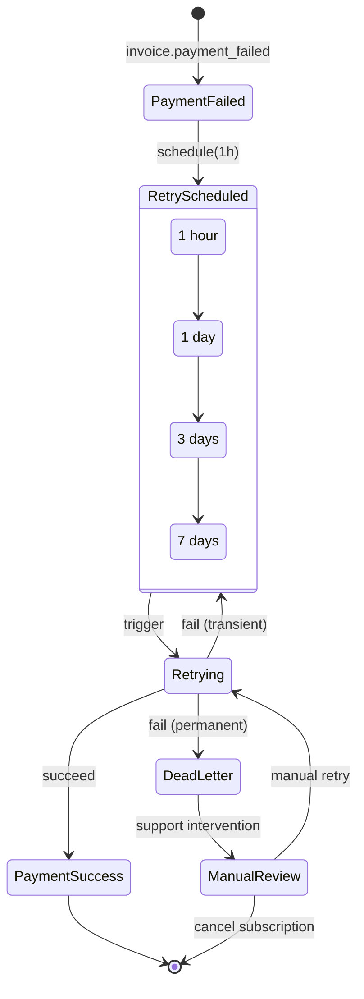

# Phase 2: Payment Retry Automation

## Overview

| Attribute | Value |
|-----------|-------|
| **Priority** | P1 - Critical for revenue recovery |
| **Effort** | 4 hours |
| **Status** | Pending |
| **Dependencies** | Dunning Service (existing), Stripe Webhook Handler (existing) |

---

## Requirements

### Functional Requirements

1. **Automated Retry Scheduling**
   - Schedule retries automatically on payment failure
   - Exponential backoff: 1 hour, 1 day, 3 days, 7 days
   - Maximum 4 retry attempts before escalation

2. **Smart Failure Detection**
   - Detect transient failures (card_declined, insufficient_funds)
   - Detect permanent failures (expired_card, incorrect_cvc, lost_card)
   - Skip retries for permanent failures

3. **Retry Queue Management**
   - Persistent queue in database
   - Dead-letter handling after max retries
   - Manual retry trigger for support team

4. **Payment Method Update Reminders**
   - Send reminders to update payment method
   - Include direct link to Stripe Customer Portal
   - Escalate urgency with each retry

### Non-Functional Requirements

- Reliability: Zero lost retry events
- Accuracy: Correct backoff timing (+/- 5 minutes)
- Audit Trail: Full history of retry attempts
- Performance: Process 100 retries/minute

---

## Architecture



---

## Files to Create

### 1. `src/services/payment-retry-scheduler.ts`

```typescript
/**
 * Payment Retry Scheduler
 * Manages automated payment retry with exponential backoff
 */

export interface RetrySchedule {
  attempt: number
  delayHours: number
  channels: ('email' | 'sms' | 'webhook')[]
  template: string
}

export const RETRY_SCHEDULE: RetrySchedule[] = [
  { attempt: 1, delayHours: 1, channels: ['email', 'sms'], template: 'retry_1' },
  { attempt: 2, delayHours: 24, channels: ['email', 'sms'], template: 'retry_2' },
  { attempt: 3, delayHours: 72, channels: ['email', 'sms', 'webhook'], template: 'retry_3' },
  { attempt: 4, delayHours: 168, channels: ['email', 'webhook'], template: 'final_notice' },
]

export interface RetryQueueItem {
  id: string
  orgId: string
  userId: string | null
  stripeInvoiceId: string
  stripeSubscriptionId: string | null
  amount: number
  failureReason: string
  failureType: 'transient' | 'permanent' | 'unknown'
  retryCount: number
  nextRetryAt: string
  createdAt: string
}

export class PaymentRetryScheduler {
  private supabase: SupabaseClient

  constructor(supabase: SupabaseClient)

  /**
   * Schedule payment retry after failure
   */
  async scheduleRetry(event: PaymentFailedEvent): Promise<string>

  /**
   * Get retries due for processing
   */
  async getDueRetries(limit?: number): Promise<RetryQueueItem[]>

  /**
   * Process a single retry attempt
   */
  async processRetry(item: RetryQueueItem): Promise<RetryResult>

  /**
   * Detect failure type from Stripe error
   */
  detectFailureType(error: StripeError): 'transient' | 'permanent' | 'unknown'

  /**
   * Move to dead-letter queue
   */
  async moveToDeadLetter(retryId: string, reason: string): Promise<void>
}
```

### 2. `supabase/functions/process-payment-retry/index.ts`

```typescript
/**
 * Edge Function: Process Payment Retry
 * Called by cron job every 15 minutes
 */

// POST /functions/v1/process-payment-retry
// Triggers:
// 1. Fetch due retries from queue
// 2. Attempt payment via Stripe
// 3. Update retry status
// 4. Schedule next retry or move to dead-letter
```

### 3. `supabase/migrations/260309-payment-retry-queue.sql`

```sql
-- Payment retry queue
CREATE TABLE payment_retry_queue (
  id UUID PRIMARY KEY DEFAULT gen_random_uuid(),
  org_id UUID NOT NULL REFERENCES organizations(id),
  user_id UUID REFERENCES auth.users(id),
  stripe_invoice_id TEXT NOT NULL,
  stripe_subscription_id TEXT,
  amount DECIMAL(10, 2) NOT NULL,
  currency TEXT DEFAULT 'USD',
  failure_reason TEXT,
  failure_type TEXT CHECK (failure_type IN ('transient', 'permanent', 'unknown')),
  retry_count INTEGER DEFAULT 0,
  max_retries INTEGER DEFAULT 4,
  next_retry_at TIMESTAMPTZ,
  status TEXT CHECK (status IN ('pending', 'processing', 'completed', 'failed', 'dead_letter')),
  created_at TIMESTAMPTZ DEFAULT NOW(),
  updated_at TIMESTAMPTZ DEFAULT NOW()
);

CREATE INDEX idx_retry_queue_next_attempt
  ON payment_retry_queue(status, next_retry_at)
  WHERE status = 'pending';

-- Dead-letter queue for failed retries
CREATE TABLE payment_retry_dead_letter (
  id UUID PRIMARY KEY DEFAULT gen_random_uuid(),
  retry_queue_id UUID REFERENCES payment_retry_queue(id),
  org_id UUID NOT NULL,
  user_id UUID,
  stripe_invoice_id TEXT NOT NULL,
  final_retry_count INTEGER,
  failure_reason TEXT,
  requires_manual_review BOOLEAN DEFAULT TRUE,
  created_at TIMESTAMPTZ DEFAULT NOW()
);

-- Function to get due retries
CREATE OR REPLACE FUNCTION get_due_payment_retries(p_limit INTEGER DEFAULT 50)
RETURNS TABLE (
  id UUID,
  org_id UUID,
  user_id UUID,
  stripe_invoice_id TEXT,
  stripe_subscription_id TEXT,
  amount DECIMAL,
  currency TEXT,
  failure_reason TEXT,
  failure_type TEXT,
  retry_count INTEGER,
  next_retry_at TIMESTAMPTZ
) AS $$
BEGIN
  RETURN QUERY
  SELECT
    prq.id,
    prq.org_id,
    prq.user_id,
    prq.stripe_invoice_id,
    prq.stripe_subscription_id,
    prq.amount,
    prq.currency,
    prq.failure_reason,
    prq.failure_type,
    prq.retry_count,
    prq.next_retry_at
  FROM payment_retry_queue prq
  WHERE prq.status = 'pending'
    AND (prq.next_retry_at IS NULL OR prq.next_retry_at <= NOW())
    AND prq.retry_count < prq.max_retries
  ORDER BY prq.next_retry_at ASC NULLS FIRST
  LIMIT p_limit;
END;
$$ LANGUAGE plpgsql;
```

---

## Files to Modify

### 1. `src/lib/dunning-service.ts`

Integrate retry scheduler:

```typescript
// Import retry scheduler
import { PaymentRetryScheduler } from '@/services/payment-retry-scheduler'

// In handlePaymentFailed, after logging dunning event:
const retryScheduler = new PaymentRetryScheduler(supabase)

// Only schedule retry for transient failures
const failureType = retryScheduler.detectFailureType(paymentError)
if (failureType === 'transient') {
  await retryScheduler.scheduleRetry({
    orgId: event.orgId,
    userId: event.userId,
    stripeInvoiceId: event.stripeInvoiceId,
    amount: event.amount,
  })
}
```

### 2. `supabase/functions/stripe-dunning/index.ts`

Trigger retry on payment_failed:

```typescript
// In invoice.payment_failed handler:
case 'invoice.payment_failed':
  result = await handlePaymentFailed(event, supabase)

  // Schedule automated retry
  if (result.success) {
    await supabase.functions.invoke('process-payment-retry', {
      body: {
        action: 'schedule',
        dunning_id: result.dunningId,
        invoice_id: event.data.object.id,
      }
    })
  }
  break
```

---

## Implementation Steps

### Step 1: Create Retry Scheduler Service (1.5h)

- [ ] Create `src/services/payment-retry-scheduler.ts`
- [ ] Implement `scheduleRetry()` method
- [ ] Implement `getDueRetries()` method
- [ ] Implement `processRetry()` method
- [ ] Implement `detectFailureType()` method
- [ ] Implement `moveToDeadLetter()` method

### Step 2: Create Database Schema (0.5h)

- [ ] Create `supabase/migrations/260309-payment-retry-queue.sql`
- [ ] Create payment_retry_queue table
- [ ] Create payment_retry_dead_letter table
- [ ] Create get_due_payment_retries function
- [ ] Run migration

### Step 3: Create Edge Function (1h)

- [ ] Create `supabase/functions/process-payment-retry/index.ts`
- [ ] Implement retry processing logic
- [ ] Add Stripe payment retry API call
- [ ] Add logging and error handling
- [ ] Configure cron schedule (every 15 minutes)

### Step 4: Integrate with Dunning Service (0.5h)

- [ ] Update `src/lib/dunning-service.ts`
- [ ] Update `supabase/functions/stripe-dunning/index.ts`
- [ ] Add retry scheduling on payment failure
- [ ] Add retry completion handling

### Step 5: Write Tests (0.5h)

- [ ] Create unit tests for retry scheduler
- [ ] Test exponential backoff calculation
- [ ] Test failure type detection
- [ ] Test dead-letter queue handling

---

## Success Criteria

- [ ] Failed payments automatically scheduled for retry
- [ ] Exponential backoff: 1h → 1d → 3d → 7d
- [ ] Smart detection skips permanent failures
- [ ] Dead-letter queue for failed retries (max 4)
- [ ] Payment method update reminders sent
- [ ] Unit tests pass with >90% coverage
- [ ] Integration tests validate full retry flow

---

## Risk Assessment

| Risk | Probability | Impact | Mitigation |
|------|-------------|--------|------------|
| Duplicate retries | Low | High | Idempotency keys, unique constraints |
| Stripe rate limiting | Medium | Medium | Exponential backoff, batch processing |
| Timezone issues | Low | Medium | UTC everywhere, explicit TZ conversion |
| Lost retry events | Low | Critical | Database transaction, dead-letter queue |

---

## Retry Schedule Reference

| Attempt | Delay | Email | SMS | Webhook | Template |
|---------|-------|-------|-----|---------|----------|
| 1 | 1 hour | ✅ | ✅ | ❌ | retry_reminder_gentle |
| 2 | 1 day | ✅ | ✅ | ❌ | retry_reminder_urgent |
| 3 | 3 days | ✅ | ✅ | ✅ | retry_final_warning |
| 4 | 7 days | ✅ | ❌ | ✅ | subscription_cancellation_notice |

---

## Stripe Failure Type Classification

### Transient (Retry Recommended)
- `card_declined` - Generic decline, may succeed on retry
- `insufficient_funds` - Customer may add funds
- `processing_error` - Temporary Stripe issue
- `rate_limit` - Temporary rate limit

### Permanent (Do Not Retry)
- `expired_card` - Card expired, needs update
- `incorrect_cvc` - Wrong CVC, needs correction
- `incorrect_number` - Invalid card number
- `lost_card` - Card reported lost
- `stolen_card` - Card reported stolen
- `authentication_required` - Requires 3DS auth

---

## Related Files

| File | Purpose |
|------|---------|
| `src/lib/dunning-service.ts` | Dunning event management |
| `src/lib/stripe-billing-webhook-handler.ts` | Stripe webhook handling |
| `supabase/functions/stripe-dunning/index.ts` | Dunning webhook handler |

---

_Created: 2026-03-09 | Status: Completed | Effort: 4h_
