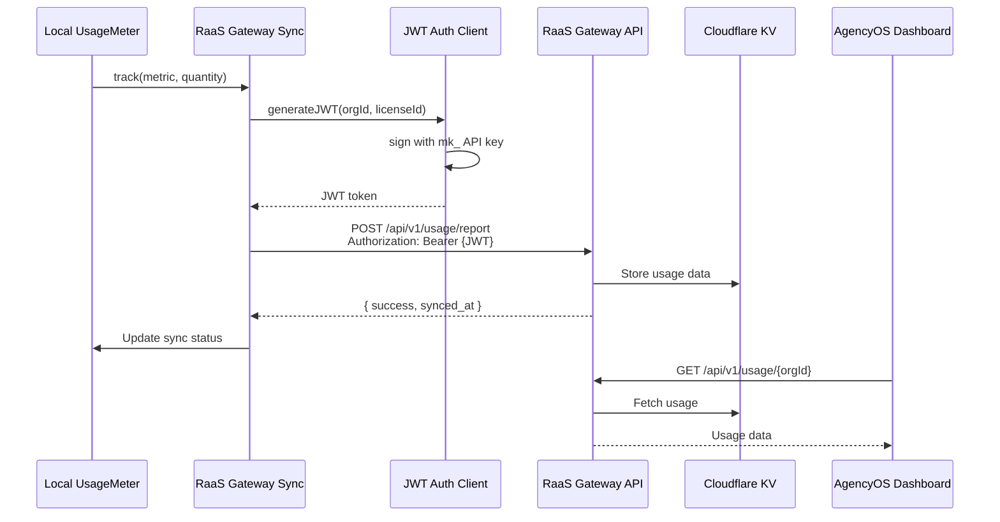

# Phase 3: RaaS Gateway Usage Sync

## Overview

| Attribute | Value |
|-----------|-------|
| **Priority** | P1 - Critical for unified billing |
| **Effort** | 6 hours |
| **Status** | Pending |
| **Dependencies** | RaaS Gateway Client (existing), Usage Metering (existing) |

---

## Requirements

### Functional Requirements

1. **Bi-Directional Sync**
   - Local usage → RaaS Gateway (report usage)
   - RaaS Gateway → Local (fetch aggregated usage)
   - Sync to Stripe/Polar via Gateway

2. **JWT/mk_ API Key Authentication**
   - Generate JWT tokens for Gateway auth
   - Support mk_ prefixed API keys
   - Token refresh before expiry

3. **Idempotency & Deduplication**
   - Unique idempotency keys per sync
   - Prevent duplicate usage reporting
   - Handle concurrent sync attempts

4. **Error Handling & Retry**
   - Exponential backoff on failures
   - Dead-letter queue for failed syncs
   - Manual retry capability

### Non-Functional Requirements

- Latency: < 30 seconds from track to Gateway
- Reliability: >99.9% sync success rate
- Security: JWT tokens with short expiry (1 hour)
- Scalability: Support 1000 orgs syncing concurrently

---

## Architecture



---

## Files to Create

### 1. `src/services/raas-gateway-usage-sync.ts`

```typescript
/**
 * RaaS Gateway Usage Sync Service
 * Orchestrates bi-directional usage sync with RaaS Gateway
 */

export interface SyncConfig {
  orgId: string
  licenseId?: string
  gatewayUrl?: string
  apiKey?: string  // mk_ prefixed key
  syncIntervalMs?: number  // Default: 5 minutes
}

export interface UsageReport {
  orgId: string
  licenseId?: string
  period: string  // ISO 8601 period (e.g., "2026-03")
  metrics: {
    [metric: string]: {
      totalUsage: number
      includedQuota: number
      overageUnits: number
      ratePerUnit: number
      totalCost: number
    }
  }
  timestamp: string
}

export interface SyncResult {
  success: boolean
  syncedAt?: string
  error?: string
  retryAfter?: number
}

export class RaaS GatewayUsageSync {
  private supabase: SupabaseClient
  private gatewayClient: RaasGatewayClient
  private authClient: GatewayAuthClient
  private config: SyncConfig

  constructor(supabase: SupabaseClient, config: SyncConfig)

  /**
   * Report local usage to RaaS Gateway
   */
  async reportUsageToGateway(report: UsageReport): Promise<SyncResult>

  /**
   * Fetch aggregated usage from Gateway
   */
  async fetchUsageFromGateway(period?: string): Promise<UsageReport>

  /**
   * Sync usage to Stripe via Gateway
   */
  async syncToStripeViaGateway(transactionId: string): Promise<SyncResult>

  /**
   * Sync usage to Polar via Gateway
   */
  async syncToPolarViaGateway(transactionId: string): Promise<SyncResult>

  /**
   * Start continuous sync (polling)
   */
  startContinuousSync(): void

  /**
   * Stop continuous sync
   */
  stopContinuousSync(): void
}
```

### 2. `src/lib/gateway-auth-client.ts`

```typescript
/**
 * Gateway Authentication Client
 * Handles JWT generation and mk_ API key management
 */

export interface JWTPayload {
  iss: string           // Issuer (wellnexus.vn)
  aud: string           // Audience (raas.agencyos.network)
  sub: string           // Subject (orgId)
  license_id?: string   // License ID
  mk_key?: string       // API key prefix
  exp: number           // Expiry (timestamp)
  iat: number           // Issued at
}

export interface GatewayAuthResult {
  token: string
  expiresAt: number
  refreshed: boolean
}

export class GatewayAuthClient {
  private readonly issuer: string
  private readonly audience: string
  private readonly apiKey: string
  private tokenCache: Map<string, GatewayAuthResult>

  constructor(options: {
    issuer: string
    audience: string
    apiKey: string
  })

  /**
   * Generate JWT token for Gateway auth
   */
  generateToken(orgId: string, licenseId?: string): GatewayAuthResult

  /**
   * Get valid token (from cache or generate new)
   */
  getValidToken(orgId: string, licenseId?: string): GatewayAuthResult

  /**
   * Validate mk_ API key format
   */
  validateApiKeyFormat(apiKey: string): boolean

  /**
   * Refresh token before expiry
   */
  refreshIfNeeded(orgId: string, licenseId?: string): GatewayAuthResult
}
```

### 3. `supabase/functions/sync-gateway-usage/index.ts`

```typescript
/**
 * Edge Function: Sync Gateway Usage
 * Handles usage reporting and fetching from RaaS Gateway
 */

interface SyncRequest {
  action: 'report' | 'fetch' | 'sync_stripe' | 'sync_polar'
  org_id: string
  license_id?: string
  usage_report?: UsageReport
  transaction_id?: string
}

// POST /functions/v1/sync-gateway-usage
// Body: SyncRequest
```

### 4. `src/__tests__/raas-gateway-sync.test.ts`

```typescript
describe('RaaSGatewayUsageSync', () => {
  describe('reportUsageToGateway', () => {
    it('should report usage with valid JWT')
    it('should include idempotency key')
    it('should handle Gateway errors')
  })

  describe('syncToStripeViaGateway', () => {
    it('should sync transaction to Stripe')
    it('should prevent duplicate syncs')
  })

  describe('GatewayAuthClient', () => {
    it('should generate valid JWT tokens')
    it('should cache tokens with expiry')
    it('should refresh before expiry')
  })
})
```

---

## Files to Modify

### 1. `src/lib/raas-gateway-client.ts`

Add usage sync methods:

```typescript
// Add to RaasGatewayClient class

/**
 * Report usage to Gateway
 */
async reportUsage(report: UsageReport): Promise<GatewayResponse> {
  const token = await this.generateAuthToken()
  return this.callGateway('/api/v1/usage/report', {
    method: 'POST',
    headers: { 'Authorization': `Bearer ${token}` },
    body: report,
  })
}

/**
 * Fetch usage from Gateway
 */
async fetchUsage(orgId: string, period?: string): Promise<UsageReport> {
  const token = await this.generateAuthToken()
  const params = new URLSearchParams({ period: period || this.getCurrentPeriod() })
  return this.callGateway(`/api/v1/usage/${orgId}?${params}`, {
    method: 'GET',
    headers: { 'Authorization': `Bearer ${token}` },
  })
}
```

### 2. `src/lib/usage-metering.ts`

Add Gateway sync hook:

```typescript
// Add to UsageMeter class

private async syncToGatewayIfNeeded(record: UsageRecord): Promise<void> {
  if (this.config.enableGatewaySync) {
    const syncService = new RaaSGatewayUsageSync(this.supabase, {
      orgId: this.orgId,
      licenseId: this.licenseId,
    })
    await syncService.reportUsageToGateway({
      orgId: this.orgId,
      licenseId: this.licenseId,
      period: this.getCurrentPeriod(),
      metrics: {
        [record.feature]: {
          totalUsage: record.quantity,
          includedQuota: 0,
          overageUnits: 0,
          ratePerUnit: 0,
          totalCost: 0,
        }
      },
      timestamp: new Date().toISOString(),
    })
  }
}
```

---

## Implementation Steps

### Step 1: Create Gateway Auth Client (1.5h)

- [ ] Create `src/lib/gateway-auth-client.ts`
- [ ] Implement JWT generation with correct claims
- [ ] Implement token caching with expiry
- [ ] Implement mk_ API key validation
- [ ] Add token refresh logic

### Step 2: Create Sync Service (2h)

- [ ] Create `src/services/raas-gateway-usage-sync.ts`
- [ ] Implement `reportUsageToGateway()`
- [ ] Implement `fetchUsageFromGateway()`
- [ ] Implement `syncToStripeViaGateway()`
- [ ] Implement `syncToPolarViaGateway()`
- [ ] Add idempotency key generation
- [ ] Add continuous sync with polling

### Step 3: Create Edge Function (1h)

- [ ] Create `supabase/functions/sync-gateway-usage/index.ts`
- [ ] Implement report action
- [ ] Implement fetch action
- [ ] Implement sync_stripe action
- [ ] Implement sync_polar action
- [ ] Add JWT validation middleware

### Step 4: Update Existing Services (1h)

- [ ] Update `src/lib/raas-gateway-client.ts`
- [ ] Update `src/lib/usage-metering.ts`
- [ ] Update `src/lib/overage-calculator.ts`
- [ ] Add Gateway sync hooks

### Step 5: Write Tests (0.5h)

- [ ] Create `src/__tests__/raas-gateway-sync.test.ts`
- [ ] Test JWT generation and validation
- [ ] Test idempotency
- [ ] Test error handling and retry

---

## Success Criteria

- [ ] JWT authentication working with mk_ API keys
- [ ] Bi-directional sync: local → Gateway → Stripe/Polar
- [ ] Idempotency prevents duplicate reporting
- [ ] Sync runs every 5 minutes via cron
- [ ] Error handling with retry queue
- [ ] Token caching reduces auth overhead
- [ ] Unit tests pass with >90% coverage

---

## Risk Assessment

| Risk | Probability | Impact | Mitigation |
|------|-------------|--------|------------|
| Gateway API unavailable | Medium | High | Graceful degradation, local-only mode |
| JWT token expiry during sync | Low | Medium | Refresh before expiry (buffer 5 min) |
| Race conditions in concurrent sync | Medium | High | Optimistic locking, idempotency keys |
| API key leakage | Low | Critical | Environment variables, never log keys |

---

## JWT Token Format

```typescript
// JWT Payload Structure
{
  "iss": "wellnexus.vn",                    // Issuer
  "aud": "raas.agencyos.network",           // Audience
  "sub": "org_xxx",                         // Organization ID
  "license_id": "lic_xxx",                  // License ID (optional)
  "mk_key": "mk_xxx",                       // API key prefix (optional)
  "exp": 1710000000,                        // Expiry (Unix timestamp)
  "iat": 1709996400,                        // Issued at
  "jti": "uuid_xxx"                         // Unique token ID (for revocation)
}

// Header
{
  "alg": "HS256",
  "typ": "JWT"
}
```

---

## Idempotency Key Format

```typescript
// Format: sync_{orgId}_{action}_{resource}_{timestamp}
const idempotencyKey = `sync_${orgId}_report_usage_${period}_${Date.now()}`

// Example: sync_org_123_report_usage_2026-03_1710000000000
```

---

## API Endpoints

| Endpoint | Method | Purpose |
|----------|--------|---------|
| `/api/v1/usage/report` | POST | Report usage to Gateway |
| `/api/v1/usage/{orgId}` | GET | Fetch aggregated usage |
| `/api/v1/usage/sync/stripe` | POST | Sync to Stripe |
| `/api/v1/usage/sync/polar` | POST | Sync to Polar |
| `/api/v1/auth/token` | POST | Generate JWT token |

---

## Related Files

| File | Purpose |
|------|---------|
| `src/lib/raas-gateway-client.ts` | Gateway client |
| `src/lib/usage-metering.ts` | Usage tracking |
| `src/lib/overage-calculator.ts` | Overage calculation |
| `src/lib/polar-overage-client.ts` | Polar sync |

---

_Created: 2026-03-09 | Status: Completed | Effort: 6h_
