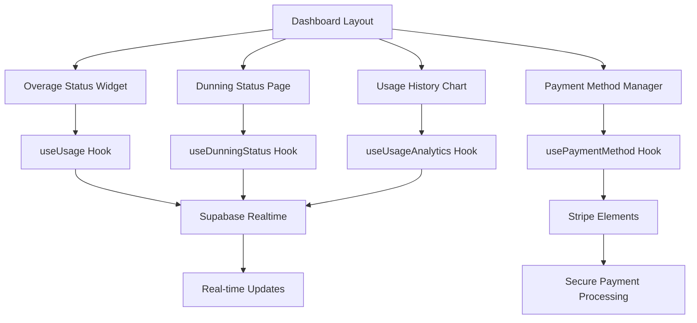

# Phase 4: Dashboard UI

## Overview

| Attribute | Value |
|-----------|-------|
| **Priority** | P2 - Important for user experience |
| **Effort** | 6 hours |
| **Status** | Pending |
| **Dependencies** | Notification Service (Phase 1), Retry Scheduler (Phase 2), Gateway Sync (Phase 3) |

---

## Requirements

### Functional Requirements

1. **Overage Status Widget**
   - Current usage vs quota for all metrics
   - Progress bars with threshold indicators
   - Overage cost breakdown
   - Projection to end of billing period
   - Plan upgrade CTAs when approaching limits

2. **Dunning Status Page**
   - Current dunning stage display
   - Amount owed with due date
   - Payment retry countdown timer
   - Payment method update button
   - Invoice history table

3. **Usage History Chart**
   - 30-day usage trend visualization
   - Quota vs actual comparison
   - Overage events marked on timeline
   - Metric breakdown (stacked area chart)
   - Export to CSV functionality

4. **Payment Method Manager**
   - Stripe Elements payment form
   - Current card display (last 4 digits)
   - Card brand icon (Visa, Mastercard, etc.)
   - Update/replace flow
   - Invoice history with download links

5. **Plan Upgrade CTAs**
   - Contextual prompts when approaching limits
   - Plan comparison modal
   - One-click upgrade flow
   - Proration calculation display

### Non-Functional Requirements

- Performance: < 2 second initial load
- Accessibility: WCAG 2.1 AA compliant
- Responsive: Mobile, tablet, desktop support
- i18n: Vietnamese and English complete

---

## Architecture



---

## Files to Create

### 1. `src/pages/dashboard/billing/overage-status.tsx`

```tsx
/**
 * Overage Status Page
 * Comprehensive view of usage and overage charges
 */

interface OverageStatusPageProps {
  orgId: string
}

export const OverageStatusPage: React.FC<OverageStatusPageProps> = ({ orgId }) => {
  const { usage, overage, loading, error } = useOverageStatus(orgId)

  return (
    <div className="space-y-6">
      {/* Usage Overview Cards */}
      <UsageOverviewCards usage={usage} />

      {/* Overage Breakdown */}
      <OverageBreakdownTable overage={overage} />

      {/* Usage Projection */}
      <UsageProjectionChart historical={usage} />

      {/* Plan Upgrade CTA */}
      {shouldShowUpgradeCTA(usage) && <PlanUpgradeCTA usage={usage} />}
    </div>
  )
}
```

### 2. `src/pages/dashboard/billing/dunning-status.tsx`

```tsx
/**
 * Dunning Status Page
 * Payment failure state and recovery flow
 */

interface DunningStatusPageProps {
  orgId: string
}

export const DunningStatusPage: React.FC<DunningStatusPageProps> = ({ orgId }) => {
  const { dunningEvent, retryCountdown, loading } = useDunningStatus(orgId)

  if (!dunningEvent) {
    return <NoDunningState />
  }

  return (
    <div className="space-y-6">
      {/* Warning Banner */}
      <DunningWarningBanner stage={dunningEvent.dunningStage} />

      {/* Amount Owed Card */}
      <AmountOwedCard
        amount={dunningEvent.amountOwed}
        dueDate={dunningEvent.dueDate}
        currency={dunningEvent.currency}
      />

      {/* Retry Countdown */}
      <RetryCountdownTimer
        nextRetryAt={retryCountdown}
        attemptCount={dunningEvent.attemptCount}
      />

      {/* Payment Method Update */}
      <PaymentMethodUpdateCTA
        paymentUrl={dunningEvent.paymentUrl}
        onPaymentUpdate={handlePaymentUpdate}
      />

      {/* Invoice History */}
      <InvoiceHistoryTable orgId={orgId} />
    </div>
  )
}
```

### 3. `src/components/billing/UsageHistoryChart.tsx`

```tsx
/**
 * Usage History Chart
 * 30-day usage trend visualization with Framer Motion
 */

interface UsageHistoryChartProps {
  orgId: string
  metricType?: AlertMetricType
  period?: string
}

export const UsageHistoryChart: React.FC<UsageHistoryChartProps> = ({
  orgId,
  metricType,
  period = '30d'
}) => {
  const { data, loading } = useUsageHistory(orgId, metricType, period)

  return (
    <div className="bg-zinc-900/50 rounded-xl border border-white/10 p-6">
      <div className="flex items-center justify-between mb-4">
        <h3 className="text-lg font-semibold text-white">
          {metricType ? ALERT_METRIC_INFO[metricType].label : 'Tất cả chỉ số'}
        </h3>
        <PeriodSelector current={period} onChange={setPeriod} />
      </div>

      {loading ? (
        <ChartSkeleton />
      ) : (
        <ResponsiveContainer width="100%" height={300}>
          <AreaChart data={data}>
            <XAxis dataKey="date" stroke="#71717a" />
            <YAxis stroke="#71717a" />
            <Tooltip content={<CustomTooltip />} />
            <Area
              type="monotone"
              dataKey="usage"
              stroke="#10b981"
              fill="#10b981/20"
              animationDuration={1000}
            />
            <ReferenceLine y={quotaLimit} stroke="#f59e0b" strokeDasharray="3 3" />
          </AreaChart>
        </ResponsiveContainer>
      )}
    </div>
  )
}
```

### 4. `src/components/billing/PaymentMethodManager.tsx`

```tsx
/**
 * Payment Method Manager
 * Stripe Elements form for payment method management
 */

interface PaymentMethodManagerProps {
  customerId: string
  onPaymentMethodUpdate?: (paymentMethod: PaymentMethod) => void
}

export const PaymentMethodManager: React.FC<PaymentMethodManagerProps> = ({
  customerId,
  onPaymentMethodUpdate
}) => {
  const { loadStripe, stripePromise } = useStripe(customerId)
  const { paymentMethod, loading } = usePaymentMethod(customerId)

  return (
    <div className="space-y-4">
      {/* Current Payment Method */}
      {paymentMethod && (
        <CurrentPaymentMethodCard
          card={paymentMethod.card}
          onReplace={handleReplace}
        />
      )}

      {/* Stripe Elements Form */}
      <Elements stripe={stripePromise}>
        <PaymentElementForm
          onSubmit={handleSubmit}
          onSuccess={onPaymentMethodUpdate}
        />
      </Elements>

      {/* Invoice History */}
      <InvoiceHistoryList customerId={customerId} />
    </div>
  )
}
```

### 5. `src/components/billing/PlanUpgradeCTA.tsx`

```tsx
/**
 * Plan Upgrade CTA
 * Contextual prompts when approaching usage limits
 */

interface PlanUpgradeCTAProps {
  usage: UsageStatus
  currentTier: LicenseTier
}

export const PlanUpgradeCTA: React.FC<PlanUpgradeCTAProps> = ({
  usage,
  currentTier
}) => {
  const [showModal, setShowModal] = useState(false)

  const approachingLimits = getApproachingLimits(usage, 80)
  if (approachingLimits.length === 0) return null

  return (
    <>
      <AlertBanner
        variant="warning"
        title="Sắp hết giới hạn"
        message={`Bạn đã sử dụng ${approachingLimits[0].percentage}% ${approachingLimits[0].metric}`}
        actionLabel="Nâng cấp gói"
        onAction={() => setShowModal(true)}
      />

      {showModal && (
        <PlanComparisonModal
          currentTier={currentTier}
          onClose={() => setShowModal(false)}
          onUpgrade={(newTier) => handleUpgrade(newTier)}
        />
      )}
    </>
  )
}
```

### 6. `src/hooks/use-billing-status.ts`

```typescript
/**
 * Billing Status Hook
 * Unified hook for billing, overage, and dunning state
 */

export function useBillingStatus(orgId: string) {
  const [status, setStatus] = useState<BillingStatus | null>(null)
  const [loading, setLoading] = useState(true)
  const [error, setError] = useState<string | null>(null)

  useEffect(() => {
    // Fetch billing status
    const fetchStatus = async () => {
      const { data } = await supabase
        .rpc('get_billing_status', { p_org_id: orgId })
      setStatus(data)
    }
    fetchStatus()
  }, [orgId])

  return { status, loading, error }
}

export function useOverageStatus(orgId: string) {
  // Implementation for overage-specific state
}

export function useDunningStatus(orgId: string) {
  // Implementation for dunning-specific state
}
```

---

## Files to Modify

### 1. `src/pages/dashboard/billing/index.tsx`

Integrate new components:

```tsx
// Main billing dashboard page
export const BillingDashboard: React.FC = () => {
  const { orgId } = useOrganization()
  const { status, loading } = useBillingStatus(orgId)

  return (
    <div className="space-y-8">
      {/* Current Plan Card */}
      <CurrentPlanCard tier={status?.tier} />

      {/* Usage Overview */}
      <UsageOverviewGrid usage={status?.usage} />

      {/* Overage Status */}
      {status?.overage?.totalCost > 0 && (
        <OverageSummaryCard overage={status.overage} />
      )}

      {/* Dunning Alert */}
      {status?.dunning?.isActive && (
        <DunningAlert dunning={status.dunning} />
      )}

      {/* Quick Actions */}
      <BillingQuickActions
        onUpgrade={() => navigate('/billing/upgrade')}
        onPaymentMethod={() => navigate('/billing/payment-method')}
        onInvoices={() => navigate('/billing/invoices')}
      />
    </div>
  )
}
```

### 2. `src/locales/vi/billing.ts` and `src/locales/en/billing.ts`

Add UI translations:

```typescript
export default {
  // ... existing
  overage: {
    status: 'Trạng thái vượt mức',
    currentUsage: 'Sử dụng hiện tại',
    quotaLimit: 'Giới hạn quota',
    overageUnits: 'Đơn vị vượt mức',
    overageCost: 'Chi phí vượt mức',
    projection: 'Dự đoán đến cuối kỳ',
    upgradeCTA: {
      title: 'Nâng cấp để tăng giới hạn',
      description: 'Nâng cấp gói để có nhiều quota hơn và giảm phí vượt mức',
      button: 'Xem các gói',
    },
  },
  dunning: {
    status: 'Trạng thái thanh toán',
    amountOwed: 'Số tiền nợ',
    dueDate: 'Hạn thanh toán',
    nextRetry: 'Lần thử tiếp theo',
    updatePayment: 'Cập nhật phương thức thanh toán',
    stages: {
      initial: 'Thanh toán thất bại',
      reminder: 'Nhắc nhở thanh toán',
      final: 'Cảnh báo cuối',
      cancel_notice: 'Thông báo hủy',
    },
  },
  paymentMethod: {
    title: 'Phương thức thanh toán',
    currentCard: 'Thẻ hiện tại',
    updateCard: 'Cập nhật thẻ',
    replaceCard: 'Thay thế thẻ',
    cardEnding: 'Thẻ kết thúc bằng',
    expires: 'Hết hạn',
  },
}
```

---

## Implementation Steps

### Step 1: Create Hooks (1.5h)

- [ ] Create `src/hooks/use-billing-status.ts`
- [ ] Implement `useBillingStatus()`
- [ ] Implement `useOverageStatus()`
- [ ] Implement `useDunningStatus()`
- [ ] Implement `useUsageHistory()`
- [ ] Implement `usePaymentMethod()`

### Step 2: Create Overage Status Page (1.5h)

- [ ] Create `src/pages/dashboard/billing/overage-status.tsx`
- [ ] Create `OverageBreakdownTable` component
- [ ] Create `UsageProjectionChart` component
- [ ] Create `PlanUpgradeCTA` component
- [ ] Add responsive styling

### Step 3: Create Dunning Status Page (1h)

- [ ] Create `src/pages/dashboard/billing/dunning-status.tsx`
- [ ] Create `DunningWarningBanner` component
- [ ] Create `RetryCountdownTimer` component
- [ ] Create `PaymentMethodUpdateCTA` component
- [ ] Add real-time countdown

### Step 4: Create Usage History Chart (1h)

- [ ] Create `src/components/billing/UsageHistoryChart.tsx`
- [ ] Implement Recharts AreaChart
- [ ] Add Framer Motion animations
- [ ] Add period selector
- [ ] Add CSV export

### Step 5: Create Payment Method Manager (1h)

- [ ] Create `src/components/billing/PaymentMethodManager.tsx`
- [ ] Integrate Stripe Elements
- [ ] Implement card display
- [ ] Implement update flow
- [ ] Add invoice history

### Step 6: Add Translations (0.5h)

- [ ] Add Vietnamese translations
- [ ] Add English translations
- [ ] Verify all UI strings translated
- [ ] Test language switching

---

## Success Criteria

- [ ] All UI components responsive and accessible
- [ ] Real-time updates via Supabase Realtime
- [ ] i18n complete for Vietnamese and English
- [ ] Payment form validates correctly
- [ ] Usage charts render with animations
- [ ] Plan upgrade flow works end-to-end
- [ ] Dunning countdown timer accurate

---

## Risk Assessment

| Risk | Probability | Impact | Mitigation |
|------|-------------|--------|------------|
| Stripe Elements loading fails | Low | High | Fallback to Customer Portal redirect |
| Realtime subscription overload | Medium | Low | Throttle updates, debounce |
| Chart rendering performance | Low | Low | Virtualize long data series |
| Mobile responsive issues | Medium | Medium | Comprehensive responsive testing |

---

## UI Component Hierarchy

```
BillingDashboard (page)
├── CurrentPlanCard
├── UsageOverviewGrid
│   ├── UsageMeterCard (api_calls)
│   ├── UsageMeterCard (tokens)
│   ├── UsageMeterCard (compute_minutes)
│   └── UsageMeterCard (model_inferences)
├── OverageSummaryCard
│   └── OverageBreakdownTable
├── DunningAlert
│   └── DunningWarningBanner
├── UsageHistoryChart
│   ├── PeriodSelector
│   └── MetricFilter
└── BillingQuickActions
    ├── UpgradeButton
    ├── PaymentMethodButton
    └── InvoicesButton
```

---

## Design System Integration

| Component | Aura Elite Token | Usage |
|-----------|-----------------|-------|
| Progress Bar | `bg-emerald-500` | Usage meters |
| Warning | `bg-amber-500/10 border-amber-400` | 80% threshold |
| Critical | `bg-orange-500/10 border-orange-400` | 90% threshold |
| Error | `bg-red-500/10 border-red-400` | 100% threshold |
| Card Background | `bg-zinc-900/50` | All cards |
| Border | `border-white/10` | All cards |

---

## Related Files

| File | Purpose |
|------|---------|
| `src/components/billing/UsageMeter.tsx` | Existing usage meter |
| `src/components/billing/UsageAlertSettings.tsx` | Alert configuration |
| `src/hooks/use-usage-metering.tsx` | Usage tracking hook |
| `src/locales/vi/billing.ts` | Vietnamese translations |

---

_Created: 2026-03-09 | Status: Completed | Effort: 6h_
