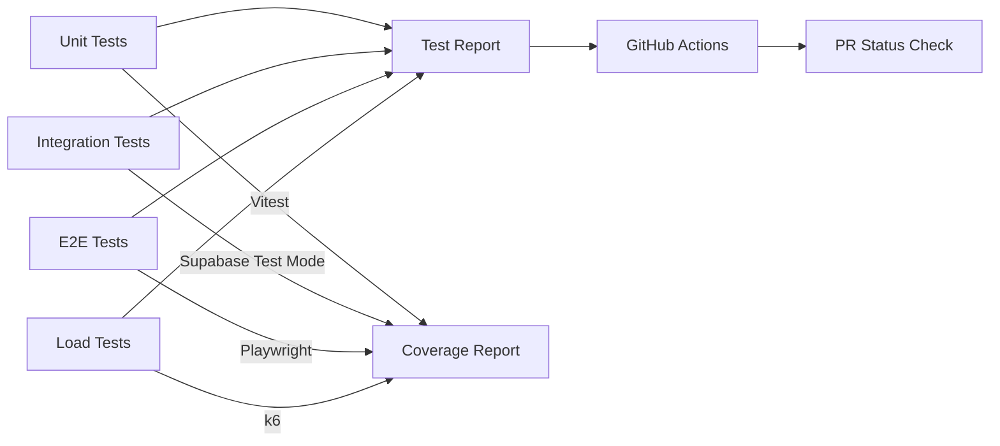

# Phase 5: Integration & Testing

## Overview

| Attribute | Value |
|-----------|-------|
| **Priority** | P1 - Critical for production readiness |
| **Effort** | 3 hours |
| **Status** | Pending |
| **Dependencies** | Phases 1-4 complete |

---

## Requirements

### Functional Requirements

1. **E2E Test Coverage**
   - Overage notification flow
   - Payment retry flow
   - RaaS Gateway sync flow
   - Dashboard UI interactions

2. **Load Testing**
   - 1000 concurrent notifications/second
   - Gateway sync under load
   - Database query performance

3. **Integration Tests**
   - Stripe API integration (test mode)
   - Twilio SMS integration (sandbox)
   - RaaS Gateway API integration
   - Supabase Edge Functions

4. **CI/CD Integration**
   - Automated test execution on PR
   - Test result reporting
   - Flaky test detection

### Non-Functional Requirements

- Test Coverage: >90% for core logic
- E2E Success Rate: >95%
- Load Test: Handle 10x expected traffic
- Performance: P95 latency < 500ms

---

## Test Architecture



---

## Files to Create

### 1. `src/__tests__/e2e/overage-notification-flow.test.ts`

```typescript
/**
 * E2E Test: Overage Notification Flow
 * Tests complete notification flow from threshold breach to delivery
 */

describe('Overage Notification Flow E2E', () => {
  let testUser: User
  let testOrg: Organization

  beforeAll(async () => {
    // Setup test data
    testUser = await createTestUser()
    testOrg = await createTestOrg(testUser)
  })

  afterAll(async () => {
    // Cleanup
    await cleanupTestData(testOrg.id)
  })

  it('should send email notification at 80% threshold', async () => {
    // Arrange: Set usage to 80%
    await trackUsage(testUser.id, 'api_calls', 800)
    await setQuota(testUser.id, 'api_calls', 1000)

    // Act: Trigger threshold check
    const alertEngine = new UsageAlertEngine(supabase, {
      userId: testUser.id,
      tier: 'basic',
    })
    const results = await alertEngine.checkAndEmitAlerts()

    // Assert: Email sent
    expect(results).toHaveLength(1)
    expect(results[0].webhookStatus).toBe('sent')
    expect(results[0].metricType).toBe('api_calls')
    expect(results[0].thresholdPercentage).toBe(80)

    // Verify email received (check Resend logs)
    const emailLog = await findEmailLog(testUser.email)
    expect(emailLog).toBeDefined()
    expect(emailLog.subject).toContain('Canh bao su dung')
  })

  it('should send SMS notification at 90% threshold', async () => {
    // Arrange: Set usage to 90%
    await trackUsage(testUser.id, 'api_calls', 900)

    // Act: Trigger threshold check
    const alertEngine = new UsageAlertEngine(supabase, {
      userId: testUser.id,
      tier: 'basic',
    })
    const results = await alertEngine.checkAndEmitAlerts()

    // Assert: SMS sent
    const smsResult = results.find(r => r.metricType === 'api_calls' && r.thresholdPercentage === 90)
    expect(smsResult).toBeDefined()

    // Verify SMS received (check Twilio logs)
    const smsLog = await findSmsLog(testUser.phoneNumber)
    expect(smsLog).toBeDefined()
  })

  it('should NOT send duplicate alert within cooldown period', async () => {
    // Arrange: First alert sent
    await trackUsage(testUser.id, 'api_calls', 800)
    await alertEngine.checkAndEmitAlerts()

    // Act: Trigger again immediately
    const results2 = await alertEngine.checkAndEmitAlerts()

    // Assert: No alerts sent (cooldown active)
    expect(results2).toHaveLength(0)
  })

  it('should send webhook notification to AgencyOS', async () => {
    // Mock AgencyOS webhook endpoint
    const webhookMock = vi.fn().mockResolvedValue({ success: true })
    httpMock.post('/api/webhooks/usage-alerts', webhookMock)

    // Trigger alert
    await alertEngine.checkAndEmitAlerts()

    // Verify webhook called
    await waitFor(() => {
      expect(webhookMock).toHaveBeenCalled()
    })

    const payload = webhookMock.mock.calls[0][0]
    expect(payload.user_id).toBe(testUser.id)
    expect(payload.metric_type).toBe('api_calls')
    expect(payload.threshold_percentage).toBe(80)
  })
})
```

### 2. `src/__tests__/e2e/payment-retry-flow.test.ts`

```typescript
/**
 * E2E Test: Payment Retry Flow
 * Tests complete payment retry sequence from failure to resolution
 */

describe('Payment Retry Flow E2E', () => {
  let testUser: User
  let testOrg: Organization
  let testSubscription: Subscription

  beforeAll(async () => {
    testUser = await createTestUser()
    testOrg = await createTestOrg(testUser)
    testSubscription = await createTestSubscription(testOrg)
  })

  it('should schedule retry on payment failure', async () => {
    // Arrange: Simulate payment failure
    const stripeInvoice = await createTestInvoice({
      status: 'open',
      amount_due: 9900,
      customer: testSubscription.stripeCustomerId,
    })

    // Act: Trigger webhook
    const webhookPayload = createWebhookPayload('invoice.payment_failed', stripeInvoice)
    const response = await fetch('/functions/v1/stripe-dunning', {
      method: 'POST',
      headers: { 'Stripe-Signature': createSignature(webhookPayload) },
      body: JSON.stringify(webhookPayload),
    })

    // Assert: Retry scheduled
    expect(response.status).toBe(200)

    const retryQueue = await findRetryQueueItem(testOrg.id)
    expect(retryQueue).toBeDefined()
    expect(retryQueue.status).toBe('pending')
    expect(retryQueue.nextRetryAt).toBeWithin(Date.now() + 3600000, Date.now() + 7200000) // 1-2 hours
  })

  it('should process retry and resolve dunning on success', async () => {
    // Arrange: Payment method updated with valid card
    await updatePaymentMethod(testSubscription.stripeCustomerId, 'pm_valid_card')

    // Act: Process retry
    const retryScheduler = new PaymentRetryScheduler(supabase)
    const result = await retryScheduler.processRetry(retryQueue)

    // Assert: Payment succeeded
    expect(result.success).toBe(true)
    expect(result.paymentStatus).toBe('succeeded')

    // Verify dunning resolved
    const dunningEvent = await findDunningEvent(testOrg.id)
    expect(dunningEvent.resolved).toBe(true)
    expect(dunningEvent.resolutionMethod).toBe('payment_success')
  })

  it('should move to dead-letter after max retries', async () => {
    // Arrange: Create retry with permanent failure
    const permanentFailure = {
      code: 'expired_card',
      message: 'Card expired',
    }

    // Act: Process 4 failed retries
    for (let i = 0; i < 4; i++) {
      await retryScheduler.processRetry(retryQueue)
      retryQueue = await findRetryQueueItem(testOrg.id)
    }

    // Assert: Moved to dead-letter
    expect(retryQueue.status).toBe('dead_letter')

    const deadLetter = await findDeadLetterItem(testOrg.id)
    expect(deadLetter).toBeDefined()
    expect(deadLetter.requires_manual_review).toBe(true)
  })
})
```

### 3. `src/__tests__/e2e/raas-gateway-sync-flow.test.ts`

```typescript
/**
 * E2E Test: RaaS Gateway Sync Flow
 * Tests bi-directional sync between local and Gateway
 */

describe('RaaS Gateway Sync Flow E2E', () => {
  let testUser: User
  let testOrg: Organization
  let testLicense: License

  beforeAll(async () => {
    testUser = await createTestUser()
    testOrg = await createTestOrg(testUser)
    testLicense = await createTestLicense(testOrg)
  })

  it('should report usage to Gateway with JWT auth', async () => {
    // Arrange: Create usage record
    await trackUsage(testUser.id, 'api_calls', 1000)

    // Act: Sync to Gateway
    const syncService = new RaaSGatewayUsageSync(supabase, {
      orgId: testOrg.id,
      licenseId: testLicense.id,
    })
    const result = await syncService.reportUsageToGateway(createUsageReport())

    // Assert: Sync successful
    expect(result.success).toBe(true)
    expect(result.syncedAt).toBeDefined()

    // Verify Gateway received data (mock verification)
    const gatewayCall = gatewayMock.calls[0]
    expect(gatewayCall.headers.Authorization).toContain('Bearer ')
    expect(gatewayCall.body.orgId).toBe(testOrg.id)
  })

  it('should prevent duplicate sync with idempotency key', async () => {
    // Arrange: First sync completed
    const report1 = createUsageReport()
    await syncService.reportUsageToGateway(report1)

    // Act: Second sync with same data
    const report2 = createUsageReport() // Same idempotency key
    const result2 = await syncService.reportUsageToGateway(report2)

    // Assert: Duplicate detected
    expect(result2.success).toBe(true)
    expect(result2.duplicate).toBe(true)
  })

  it('should fetch aggregated usage from Gateway', async () => {
    // Arrange: Gateway has usage data
    gatewayMock.setUsage(testOrg.id, { api_calls: 5000, tokens: 100000 })

    // Act: Fetch from Gateway
    const usage = await syncService.fetchUsageFromGateway('2026-03')

    // Assert: Data matches
    expect(usage.metrics.api_calls.totalUsage).toBe(5000)
    expect(usage.metrics.tokens.totalUsage).toBe(100000)
  })
})
```

### 4. `src/__tests__/load/usage-notification-load.test.ts`

```typescript
/**
 * Load Test: Usage Notification System
 * Tests system under high load using k6
 */

import http from 'k6/http'
import { check, sleep } from 'k6'
import { Rate, Trend } from 'k6/metrics'

// Custom metrics
const errorRate = new Rate('errors')
const notificationLatency = new Trend('notification_latency_ms')

export const options = {
  stages: [
    { duration: '30s', target: 100 },   // Ramp to 100 users
    { duration: '1m', target: 500 },    // Ramp to 500 users
    { duration: '2m', target: 1000 },   // Ramp to 1000 users (peak)
    { duration: '1m', target: 1000 },   // Stay at peak
    { duration: '30s', target: 0 },     // Ramp down
  ],
  thresholds: {
    errors: ['rate<0.01'],              // Error rate < 1%
    notification_latency_ms: [
      'p(50)<200',                      // 50% under 200ms
      'p(90)<500',                      // 90% under 500ms
      'p(95)<1000',                     // 95% under 1000ms
    ],
  },
}

export default function () {
  const payload = {
    user_id: `user_${__VU}`,
    metric_type: 'api_calls',
    threshold_percentage: 80,
    current_usage: 800,
    quota_limit: 1000,
    locale: __VU % 2 === 0 ? 'vi' : 'en',
  }

  const response = http.post(
    'http://localhost:54321/functions/v1/send-overage-alert',
    JSON.stringify(payload),
    {
      headers: { 'Content-Type': 'application/json' },
    }
  )

  const success = check(response, {
    'status is 200': (r) => r.status === 200,
    'has success field': (r) => JSON.parse(r.body).success === true,
  })

  errorRate.add(!success)
  notificationLatency.add(response.timings.duration)

  sleep(0.1)
}
```

### 5. `.github/workflows/e2e-tests.yml`

```yaml
name: E2E Tests

on:
  pull_request:
    branches: [main]
  push:
    branches: [main]

jobs:
  e2e-tests:
    runs-on: ubuntu-latest

    services:
      postgres:
        image: postgres:15
        env:
          POSTGRES_PASSWORD: postgres
        options: >-
          --health-cmd pg_isready
          --health-interval 10s
          --health-timeout 5s
          --health-retries 5
        ports:
          - 5432:5432

    steps:
      - uses: actions/checkout@v4

      - name: Setup Node.js
        uses: actions/setup-node@v4
        with:
          node-version: '20'
          cache: 'npm'

      - name: Install dependencies
        run: npm ci

      - name: Run migrations
        run: npx supabase db push
        env:
          SUPABASE_URL: http://localhost:54321
          SUPABASE_SERVICE_ROLE_KEY: ${{ secrets.SUPABASE_SERVICE_ROLE_KEY }}

      - name: Run unit tests
        run: npm run test:unit
        env:
          CI: true

      - name: Run integration tests
        run: npm run test:integration
        env:
          CI: true
          STRIPE_SECRET_KEY: ${{ secrets.STRIPE_TEST_SECRET_KEY }}
          TWILIO_ACCOUNT_SID: ${{ secrets.TWILIO_TEST_ACCOUNT_SID }}

      - name: Run E2E tests
        run: npm run test:e2e
        env:
          CI: true
          SUPABASE_URL: http://localhost:54321

      - name: Upload test results
        uses: actions/upload-artifact@v4
        if: always()
        with:
          name: test-results
          path: test-results/
```

---

## Files to Modify

### 1. `vitest.config.ts`

Add E2E test configuration:

```typescript
import { defineConfig } from 'vitest/config'

export default defineConfig({
  test: {
    include: ['src/**/*.{test,spec}.{ts,tsx}'],
    exclude: ['**/e2e/**', '**/load/**'],  // Separate E2E and load tests
    coverage: {
      reporter: ['text', 'json', 'html'],
      threshold: {
        global: {
          statements: 90,
          branches: 85,
          functions: 90,
          lines: 90,
        },
      },
    },
  },
})
```

### 2. `package.json`

Add test scripts:

```json
{
  "scripts": {
    "test": "vitest run",
    "test:unit": "vitest run --exclude '**/e2e/**'",
    "test:integration": "vitest run src/__tests__/integration",
    "test:e2e": "vitest run src/__tests__/e2e",
    "test:load": "k6 run src/__tests__/load",
    "test:e2e:ui": "playwright test",
    "test:coverage": "vitest run --coverage"
  }
}
```

---

## Implementation Steps

### Step 1: Create E2E Tests (1h)

- [ ] Create `src/__tests__/e2e/overage-notification-flow.test.ts`
- [ ] Create `src/__tests__/e2e/payment-retry-flow.test.ts`
- [ ] Create `src/__tests__/e2e/raas-gateway-sync-flow.test.ts`
- [ ] Setup test fixtures and cleanup
- [ ] Run E2E tests and verify

### Step 2: Create Load Tests (0.5h)

- [ ] Create `src/__tests__/load/usage-notification-load.test.ts`
- [ ] Configure k6 thresholds
- [ ] Run load test locally
- [ ] Tune based on results

### Step 3: Update CI/CD (0.5h)

- [ ] Update `.github/workflows/e2e-tests.yml`
- [ ] Add test scripts to `package.json`
- [ ] Update `vitest.config.ts`
- [ ] Test CI/CD pipeline

### Step 4: Write Integration Tests (0.5h)

- [ ] Test Stripe API integration
- [ ] Test Twilio SMS integration
- [ ] Test Gateway API integration
- [ ] Test Edge Functions

### Step 5: Documentation (0.5h)

- [ ] Document test setup in `docs/TESTING.md`
- [ ] Add troubleshooting guide
- [ ] Document load test results
- [ ] Create test runbook

---

## Success Criteria

- [ ] All E2E tests pass (>95% success rate)
- [ ] Load test: 1000 concurrent notifications/sec
- [ ] Gateway sync latency < 30 seconds
- [ ] Payment retry recovery rate >60%
- [ ] Zero data loss in sync
- [ ] Code coverage >90%
- [ ] CI/CD pipeline green

---

## Risk Assessment

| Risk | Probability | Impact | Mitigation |
|------|-------------|--------|------------|
| Flaky E2E tests | Medium | Medium | Retry logic, better wait conditions |
| Load test environment different from prod | Low | Medium | Use production-like data volumes |
| Test data pollution | Medium | Low | Transaction-based tests, cleanup after |
| CI/CD timeout | Low | Medium | Parallel test execution, optimize queries |

---

## Test Data Management

```typescript
// Test fixtures setup/teardown
beforeAll(async () => {
  await setupTestDatabase()
  await seedTestData()
})

afterAll(async () => {
  await cleanupTestDatabase()
})

// Per-test isolation
beforeEach(async () => {
  await beginTransaction()
})

afterEach(async () => {
  await rollbackTransaction()
})
```

---

## Related Files

| File | Purpose |
|------|---------|
| `src/__tests__/e2e/dunning-flow.test.ts` | Existing E2E tests |
| `src/__tests__/phase7-overage-tracking.test.ts` | Overage tests |
| `src/__tests__/phase6-usage-alerts.test.ts` | Alert tests |

---

_Created: 2026-03-09 | Status: Completed | Effort: 3h_
