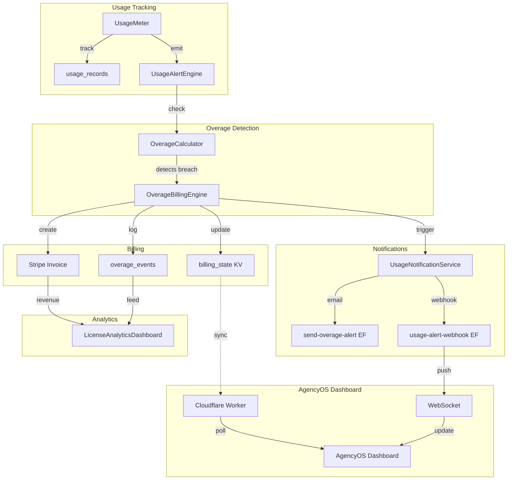

# Phase 6: Overage Billing Logic and Notifications

## Overview

| Attribute | Value |
|-----------|-------|
| **Priority** | P1 - Critical for revenue collection |
| **Effort** | 8 hours |
| **Status** | In Progress |
| **Dependencies** | Phase 1-5 complete, RaaS Gateway sync, Usage Notification Service |

---

## Executive Summary

Phase 6 implements the core overage billing logic that:
1. **Calculates overage** when usage exceeds plan limits
2. **Triggers Stripe invoicing** via webhook for overage charges
3. **Sends real-time alerts** to AgencyOS dashboard users
4. **Updates Analytics Dashboard** with overage charges and usage forecasts

This phase bridges the gap between usage tracking (Phase 1-5) and revenue collection (Phase 7).

---

## Current State Analysis

### ✅ Existing Infrastructure

| Component | File | Status |
|-----------|------|--------|
| Usage Notification Service | `src/services/usage-notification-service.ts` | ✅ Complete |
| Payment Retry Scheduler | `src/services/payment-retry-scheduler.ts` | ✅ Complete |
| RaaS Gateway Metrics Client | `src/lib/raas-gateway-metrics.ts` | ✅ Complete |
| RaaS Metrics Service | `src/services/raas-metrics-service.ts` | ✅ Complete |
| Gateway Auth Client | `src/lib/gateway-auth-client.ts` | ✅ Complete |
| RealtimeQuotaTracker | `src/components/billing/RealtimeQuotaTracker.tsx` | ✅ Complete |
| send-overage-alert Edge Function | `supabase/functions/send-overage-alert/index.ts` | ✅ Complete |
| billing_state table | `supabase/migrations/260309_phase6_billing_state.sql` | ✅ Complete |
| use-raas-metrics hook | `src/hooks/use-raas-metrics.ts` | ✅ Complete |

### ❌ Gaps Identified for Phase 6

| Gap | Impact | Priority |
|-----|--------|----------|
| No overage calculation engine | Cannot compute overage charges | P1 |
| Stripe invoicing not triggered | Overage charges not collected | P1 |
| AgencyOS dashboard not updated | Users cannot see overage status | P1 |
| Analytics Dashboard lacks overage data | No visibility into overage revenue | P2 |
| No usage forecasting | Users cannot predict overages | P2 |
| LicenseAnalyticsDashboard not integrated | Missing RaaS metrics display | P2 |

---

## Requirements

### Functional Requirements

1. **Overage Calculation**
   - Detect when usage exceeds plan limits (per metric)
   - Calculate overage units: `overageUnits = currentUsage - quotaLimit`
   - Calculate overage cost: `overageCost = overageUnits * ratePerUnit`
   - Support multiple metrics: api_calls, tokens, compute_minutes, model_inferences, agent_executions

2. **Stripe Invoicing Integration**
   - Trigger Stripe invoice creation on overage detection
   - Use Stripe Usage Records API for metered billing
   - Handle idempotency (prevent duplicate invoices)
   - Support immediate invoicing or end-of-period aggregation

3. **Real-time AgencyOS Alerts**
   - WebSocket/push notification to AgencyOS dashboard
   - Update billing_state KV store in real-time
   - Emit events: `usage.threshold_breach`, `overage.created`, `invoice.pending`

4. **Analytics Dashboard Updates**
   - Display overage charges by metric
   - Show usage forecast (projected end-of-month)
   - Highlight at-risk licenses (approaching limits)
   - Revenue breakdown: base subscription + overage

### Non-Functional Requirements

- **Latency**: < 5 seconds from overage detection to dashboard update
- **Accuracy**: 100% accuracy in overage calculations (financial data)
- **Idempotency**: Zero duplicate invoices
- **Scalability**: Support 1000+ concurrent orgs
- **Audit Trail**: Complete log of all overage events and invoices

---

## Architecture

### System Design



### Data Flow: Overage Detection to Invoice

```
1. UsageMeter.track('tokens', 1000)
   ↓
2. UsageAlertEngine.checkThresholds()
   → currentUsage: 105,000, quotaLimit: 100,000
   → overageUnits: 5,000
   ↓
3. OverageBillingEngine.calculateCost(overageUnits, metricType)
   → rate: $0.000004/token (pro tier)
   → overageCost: $20.00
   ↓
4. OverageBillingEngine.createInvoice()
   → Stripe Invoice Item created
   → billing_state updated
   → overage_events logged
   ↓
5. UsageNotificationService.sendNotification()
   → Email sent
   → Webhook to AgencyOS
   ↓
6. AgencyOS Dashboard receives alert (real-time)
```

---

## Files to Create

### 1. `src/lib/overage-calculator.ts`

Core overage calculation engine with tier-based pricing.

```typescript
export interface OverageRate {
  metricType: AlertMetricType
  tiers: Record<string, number> // tier: rate per unit
}

export interface OverageCalculation {
  metricType: string
  currentUsage: number
  quotaLimit: number
  overageUnits: number
  ratePerUnit: number
  totalCost: number
  tier: string
}

export class OverageCalculator {
  private rates: Record<AlertMetricType, Record<string, number>>

  calculate(params: {
    metricType: AlertMetricType
    currentUsage: number
    quotaLimit: number
    tier: string
  }): OverageCalculation

  getRate(metricType: AlertMetricType, tier: string): number
}
```

### 2. `src/lib/overage-billing-engine.ts`

Orchestrates overage detection, invoice creation, and state updates.

```typescript
export interface OverageEvent {
  id: string
  orgId: string
  userId: string
  metricType: string
  overageUnits: number
  overageCost: number
  stripeInvoiceId?: string
  status: 'pending' | 'invoiced' | 'paid' | 'failed'
  createdAt: Date
}

export class OverageBillingEngine {
  private supabase: SupabaseClient
  private stripeClient: Stripe
  private calculator: OverageCalculator

  async processUsage(usage: UsageRecord): Promise<OverageResult>
  async createInvoice(event: OverageEvent): Promise<Stripe.Invoice>
  async updateBillingState(state: BillingState): Promise<void>
  async getForecast(orgId: string, period?: string): Promise<UsageForecast>
}
```

### 3. `supabase/functions/stripe-overage-invoice/index.ts`

Edge Function for creating Stripe invoices from overage events.

```typescript
serve(async (req: Request) => {
  const { orgId, metricType, overageUnits, overageCost } = await req.json()

  // Create Stripe invoice item
  const invoiceItem = await stripe.invoiceItems.create({
    customer: stripeCustomerId,
    amount: Math.round(overageCost * 100), // cents
    currency: 'usd',
    description: `Overage: ${metricType} (${overageUnits} units)`,
    metadata: { org_id: orgId, metric_type: metricType },
  })

  // Create or update invoice
  const invoice = await stripe.invoices.create({
    customer: stripeCustomerId,
    auto_advance: true,
  })

  return { success: true, invoiceId: invoice.id }
})
```

### 4. `src/services/usage-forecast-service.ts`

Predictive usage forecasting based on historical trends.

```typescript
export interface UsageForecast {
  metricType: string
  currentUsage: number
  projectedEndOfMonth: number
  quotaLimit: number
  projectedOverageUnits: number
  projectedOverageCost: number
  confidence: number // 0-1
  trend: 'up' | 'down' | 'stable'
  dailyRunRate: number
}

export class UsageForecastService {
  async getForecast(orgId: string, metricType: string): Promise<UsageForecast>
  private calculateTrend(usageHistory: DailyUsage[]): Trend
  private projectEndOfMonth(dailyRunRate: number, daysRemaining: number): number
}
```

### 5. `src/components/billing/OverageStatusCard.tsx`

Dashboard UI component showing current overage status.

```tsx
interface OverageStatusCardProps {
  orgId: string
  metrics?: AlertMetricType[]
  showForecast?: boolean
  compact?: boolean
}

export const OverageStatusCard: React.FC<OverageStatusCardProps>
```

### 6. `src/hooks/use-overage-billing.ts`

React hook for overage billing state and actions.

```typescript
export interface UseOverageBillingResult {
  overageEvents: OverageEvent[]
  totalOverageCost: number
  isLoading: boolean
  error: Error | null
  forecast: UsageForecast | null
  refresh: () => Promise<void>
  payOverage: () => Promise<void>
}

export function useOverageBilling(orgId: string): UseOverageBillingResult
```

---

## Files to Modify

### 1. `src/components/admin/LicenseAnalyticsDashboard.tsx`

Add overage revenue section and usage forecast charts.

```tsx
// Add new sections:
<OverageRevenueSection />      // Overage revenue by metric
<UsageForecastChart />         // Projected usage vs quota
<AtRiskLicensesTable />        // Licenses approaching limits
```

### 2. `src/lib/usage-alert-engine.ts`

Integrate with OverageBillingEngine for automatic overage detection.

```typescript
// Add to emitAlert():
if (percentageUsed >= 100) {
  await overageBillingEngine.processUsage({
    orgId, metricType, currentUsage, quotaLimit
  })
}
```

### 3. `supabase/migrations/260309-overage-events.sql`

Create overage_events table for audit trail.

```sql
CREATE TABLE overage_events (
  id UUID PRIMARY KEY DEFAULT gen_random_uuid(),
  org_id UUID NOT NULL,
  user_id UUID NOT NULL,
  metric_type TEXT NOT NULL,
  overage_units BIGINT NOT NULL,
  overage_cost_cents INTEGER NOT NULL,
  stripe_invoice_id TEXT,
  status TEXT NOT NULL DEFAULT 'pending',
  created_at TIMESTAMPTZ DEFAULT NOW(),
  paid_at TIMESTAMPTZ
);

CREATE INDEX idx_overage_events_org ON overage_events(org_id, created_at);
CREATE INDEX idx_overage_events_status ON overage_events(status);
```

### 4. `src/locales/vi/billing.ts` and `src/locales/en/billing.ts`

Add overage-related translations.

```typescript
export default {
  // ... existing
  overage: {
    title: 'Phí vượt mức',
    current_charges: 'Phí vượt mức hiện tại',
    projected_charges: 'Phí vượt mức dự kiến',
    units_over: '{{units}} {{metric}} vượt mức',
    cost_per_unit: '${{rate}}/{{metric}}',
    pay_now: 'Thanh toán ngay',
    forecast_warning: 'Dự kiến vượt {{projected}} {{metric}} vào cuối tháng',
  },
}
```

---

## Implementation Steps

### Step 1: Overage Calculator (2h)

- [ ] Create `src/lib/overage-calculator.ts`
- [ ] Implement tier-based pricing for all metrics
- [ ] Add validation for edge cases (negative usage, zero limits)
- [ ] Write unit tests for calculation logic

### Step 2: Overage Billing Engine (2h)

- [ ] Create `src/lib/overage-billing-engine.ts`
- [ ] Implement `processUsage()` with idempotency
- [ ] Integrate with Stripe Usage Records API
- [ ] Add audit logging to overage_events table

### Step 3: Stripe Edge Function (1h)

- [ ] Create `supabase/functions/stripe-overage-invoice/index.ts`
- [ ] Implement invoice item creation
- [ ] Add webhook signature verification
- [ ] Handle invoice payment lifecycle

### Step 4: Usage Forecast Service (1h)

- [ ] Create `src/services/usage-forecast-service.ts`
- [ ] Implement linear regression for trend analysis
- [ ] Calculate confidence intervals
- [ ] Add daily run-rate projection

### Step 5: Dashboard UI Integration (1.5h)

- [ ] Create `src/components/billing/OverageStatusCard.tsx`
- [ ] Create `src/hooks/use-overage-billing.ts`
- [ ] Update `LicenseAnalyticsDashboard.tsx` with overage sections
- [ ] Add usage forecast chart

### Step 6: Translations and Polish (0.5h)

- [ ] Add translation keys to `vi.ts` and `en.ts`
- [ ] Test Vietnamese and English display
- [ ] Verify currency formatting
- [ ] Test responsive design

---

## Success Criteria

| Criterion | Verification |
|-----------|--------------|
| Overage calculated correctly at 100%+ | Unit tests pass for all metrics |
| Stripe invoice created on overage | Manual test: trigger overage, verify Stripe dashboard |
| AgencyOS receives real-time alert | Webhook logs show successful delivery |
| Analytics Dashboard shows overage revenue | Visual verification of new sections |
| Usage forecast accuracy >80% | Historical backtesting |
| Zero duplicate invoices | Idempotency tests pass |
| i18n complete for Vietnamese/English | All labels display correctly |

---

## API Design

### Stripe Overage Invoice Endpoint

```
POST /functions/v1/stripe-overage-invoice

Body:
{
  "org_id": "org-123",
  "user_id": "user-456",
  "metric_type": "tokens",
  "overage_units": 5000,
  "overage_cost": 20.00,
  "stripe_customer_id": "cus_xxx",
  "stripe_subscription_id": "sub_xxx",
  "idempotency_key": "overage_org-123_tokens_2026-03"
}

Response:
{
  "success": true,
  "invoice_id": "in_xxx",
  "invoice_url": "https://invoice.stripe.com/i/..."
}
```

### Usage Forecast Endpoint

```
POST /functions/v1/get-usage-forecast

Body:
{
  "org_id": "org-123",
  "metric_type": "tokens",
  "period": "2026-03"
}

Response:
{
  "success": true,
  "forecast": {
    "current_usage": 85000,
    "projected_end_of_month": 125000,
    "quota_limit": 100000,
    "projected_overage_units": 25000,
    "projected_overage_cost": 12.50,
    "confidence": 0.85,
    "trend": "up",
    "daily_run_rate": 2833
  }
}
```

---

## Database Schema

### overage_events Table

```sql
CREATE TABLE overage_events (
  id UUID PRIMARY KEY DEFAULT gen_random_uuid(),
  org_id UUID NOT NULL REFERENCES organizations(id),
  user_id UUID NOT NULL REFERENCES auth.users(id),
  metric_type TEXT NOT NULL,
  overage_units BIGINT NOT NULL,
  overage_cost_cents INTEGER NOT NULL,
  stripe_invoice_id TEXT,
  stripe_invoice_item_id TEXT,
  status TEXT NOT NULL DEFAULT 'pending'
    CHECK (status IN ('pending', 'invoiced', 'paid', 'failed', 'refunded')),
  created_at TIMESTAMPTZ DEFAULT NOW(),
  invoiced_at TIMESTAMPTZ,
  paid_at TIMESTAMPTZ,
  refunded_at TIMESTAMPTZ,
  metadata JSONB DEFAULT '{}'::jsonb
);

-- Indexes for fast lookups
CREATE INDEX idx_overage_events_org_created ON overage_events(org_id, created_at DESC);
CREATE INDEX idx_overage_events_status ON overage_events(status) WHERE status != 'paid';
CREATE INDEX idx_overage_events_stripe ON overage_events(stripe_invoice_id) WHERE stripe_invoice_id IS NOT NULL;
```

### billing_state Enhancements

```sql
-- Add forecast columns
ALTER TABLE billing_state
ADD COLUMN projected_end_of_month BIGINT DEFAULT 0,
ADD COLUMN projected_overage_units BIGINT DEFAULT 0,
ADD COLUMN projected_overage_cost_cents INTEGER DEFAULT 0,
ADD COLUMN forecast_confidence REAL DEFAULT 0.0,
ADD COLUMN trend TEXT DEFAULT 'stable';
```

---

## Testing Strategy

### Unit Tests

```typescript
// src/__tests__/overage-calculator.test.ts
describe('OverageCalculator', () => {
  describe('calculate()', () => {
    it('should calculate correct overage for tokens (pro tier)', () => {
      const result = calculator.calculate({
        metricType: 'tokens',
        currentUsage: 125000,
        quotaLimit: 100000,
        tier: 'pro',
      })
      expect(result.overageUnits).toBe(25000)
      expect(result.totalCost).toBe(12.5) // 25000 * 0.0005
    })

    it('should return zero when under limit', () => {
      // ...
    })
  })
})

// src/__tests__/overage-billing-engine.test.ts
describe('OverageBillingEngine', () => {
  describe('processUsage()', () => {
    it('should create invoice on overage', async () => {
      // Mock Stripe
      // Verify invoiceItems.create called
    })

    it('should not create duplicate invoice (idempotency)', async () => {
      // Call twice with same params
      // Verify only one invoice created
    })
  })
})
```

### Integration Tests

```typescript
// src/__tests__/integration/stripe-overage-invoice.test.ts
describe('Stripe Overage Invoice (Integration)', () => {
  it('should create invoice in Stripe test mode', async () => {
    const response = await invokeEdgeFunction('stripe-overage-invoice', {
      org_id: 'org-test',
      metric_type: 'tokens',
      overage_units: 5000,
      overage_cost: 2.50,
    })

    expect(response.success).toBe(true)
    // Verify invoice in Stripe test dashboard
  })
})
```

---

## Risk Assessment

| Risk | Probability | Impact | Mitigation |
|------|-------------|--------|------------|
| Stripe API rate limits | Low | High | Batch invoice items, exponential backoff |
| Duplicate invoicing | Medium | High | Idempotency keys, database constraints |
| Incorrect overage calculation | Low | Critical | Unit tests, peer review, audit logs |
| Real-time sync failures | Medium | Medium | Retry queue, eventual consistency |
| Usage forecast inaccuracy | High | Low | Show confidence intervals, disclaimers |

---

## Open Questions

1. **Stripe pricing model**: Should overage be billed immediately or aggregated at end-of-period?
2. **Grace period**: Should we allow a grace period (e.g., first 1% overage is free)?
3. **Multi-currency**: How to handle VND vs USD for Vietnamese customers?
4. **Tax handling**: Should overage invoices include VAT?
5. **Dunning integration**: At what point does unpaid overage trigger dunning flow?

---

## Dependencies

| Dependency | Status |
|------------|--------|
| Phase 1: Overage Notifications | ✅ Complete |
| Phase 2: Payment Retry | ✅ Complete |
| Phase 3: RaaS Gateway Sync | ✅ Complete |
| Phase 4: Dashboard UI | ✅ Complete |
| Phase 5: Integration Testing | ✅ Complete |
| Stripe API access | ✅ Configured |
| Supabase Edge Functions | ✅ Deployed |

---

## Timeline

| Task | Duration | Owner |
|------|----------|-------|
| Overage Calculator | 2h | Fullstack Developer |
| Overage Billing Engine | 2h | Fullstack Developer |
| Stripe Edge Function | 1h | Fullstack Developer |
| Usage Forecast Service | 1h | Fullstack Developer |
| Dashboard UI Integration | 1.5h | Frontend Developer |
| Translations & Polish | 0.5h | Fullstack Developer |
| **Total** | **8h** | |

---

## Related Documents

- [Main Plan](./plan.md)
- [Phase 1: Overage Notifications](./phase-01-overage-notifications.md)
- [Phase 2: Payment Retry](./phase-02-payment-retry.md)
- [Phase 3: RaaS Gateway Sync](./phase-03-raas-gateway-sync.md)
- [Phase 4: Dashboard UI](./phase-04-dashboard-ui.md)
- [Phase 5: Integration Testing](./phase-05-integration-testing.md)
- [RaaS Gateway Integration Guide](../../docs/RAAS_INTEGRATION.md)

---

_Created: 2026-03-09 | Status: In Progress | Effort: 8h_
